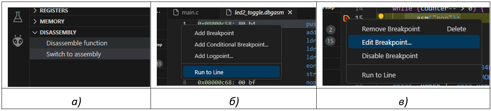
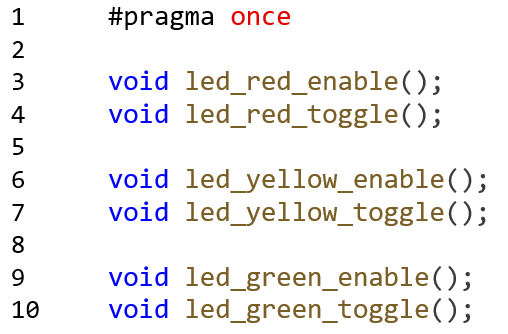

# Лабораторная работа № 1. Изучение среды разработки PlatformIO и Visual Studio Code

[Введение](#введение)\
[Цели работы](#цели-работы)\
[Порядок выполнения работы](#порядок-выполнения-работы)\
[- Этап 1. Знакомство с редактором Visual Studio Code](#этап-1-знакомство-с-редактором-visual-studio-code)\
[- Этап 2. Создание проекта](#этап-2-создание-проекта)\
[- Этап 3. Разработка программы мигания светодиодом на основе фреймворка CMSIS](#этап-3-разработка-программы-мигания-светодиодом-на-основе-фреймворка-cmsis)\
[- Этап 4. Исследование кода программы и библиотеки CMSIS](#этап-4-исследование-кода-программы-и-библиотеки-cmsis)\
[- Этап 5. Сборка программы](#этап-5-сборка-программы)\
[- Этап 6. Загрузка программы в память микроконтроллера](#этап-6-загрузка-программы-в-память-микроконтроллера)\
[- Этап 7. Работа с отладчиком](#этап-7-работа-с-отладчиком)\
[Задания для самостоятельного выполнения](#задания-для-самостоятельного-выполнения)\
[- Задание 1](#задание-1)\
[- Задание 2](#задание-2)\
[- Задание 3](#задание-3)

## Введение
Visual Studio Code (далее по тексту VSCode) – это текстовый редактор для написания программного кода с поддержкой большого числа языков программирования.

PlatformIO – это набор средств разработки для микроконтроллеров, который может быть установлен в виде расширения VSCode. 

Вместе VSCode и PlatformIO образуют свободно распространяемую и кроссплатформенную среду разработки (IDE) для микроконтроллеров различных архитектур и семейств.


## Цели работы

1. Ознакомиться с пользовательским интерфейсом среды разработки.
2. Научиться создавать новый проект и редактировать его настройки.
3.	Научиться читать, редактировать, компилировать код.
4.	Научиться загружать код в микроконтроллер и пользоваться средствами отладки.
5.	Познакомиться с библиотекой CMSIS и портами ввода-вывода общего назначения (GPIO).
6.	Научиться структурировать путем создания библиотек.

## Порядок выполнения работы

### Этап 1. Знакомство с редактором Visual Studio Code

1. Запустите Visual Studio Code c помощью ярлыка на рабочем столе.
2. Рассмотрите основные элементы редактора VSCode на экране и рисунке (рис 1.2). 

По левой границе окна VSCode располагается <u>Панель выбора активности</u> (Activity Bar) и <u>Основная панель</u>. Вдоль нижней границы окна находится <u>Строка</u> состояния. По верхней границе окна находится системное <u>Меню</u> и кнопки отображения панелей.

Управление редактором может осуществляться различными способами:
- с помощью мыши и графических элементов управления (меню, кнопок);
- путем ввода команд в *Палитру команд*;
- с помощью «горячих» клавиш. 

Последние два способа обеспечивают наиболее быструю и эффективную работу с редактором.

<p align="center" > </p>

<p align="center" >Рисунок 1.1 – Окно VSCode после открытия проекта.</p>  

### Этап 2. Создание проекта

- [x] 1. Откройте домашнюю страницу PlatformIO. 
- [x] 1.1. На Панели активности выбрать PlatformIO .  
- [x] 1.2. В *Основной панели* во вкладке *Quick Aсcess* выберите команду *PioHome -> Open*.
- [x] 2. Создайте новый проект 
- [x] 2.1. Нажать кнопку *+New Project* чтобы открыть окно Project Wizard (рис. 1,.1 a)
- [x] 2.2. Ввести в поле *Name* название проекта. 

> Для названия проекта рекомендуется использовать латинские буквы и шаблон «группа_фамилия_работа». Например: ivt31_ivanonv_lab01.

- [x] 2.3. Ввести в поле Board название вашей платы разработчика (ST Nucleo H745ZI Q или ST Nucleo F303ZE) 
- [x] 2.4. Выбрать в поле *Framework* – CMSIS. 
- [x] 2.5. Навести курсор мыши на знак ```?``` в строке «Use default location» и запомните расположение проекта. Путь к проекту должен состоять из латинских символов.
- [x] 2.6. Нажать *Finish*. PlatformIO создаст папку с проектами откроет папку с проектами. 

<p align="center" > </p>

<p align="center" >Рисунок 1.2 – Окно при создании проекта.</p>  

- [x] 2.7. Для того, чтобы в будущем открыть этот или другой проект следует выполнить команду меню *File -> Open Folder….* и указать путь к паке с проектом.

> Необходимо делать копии своих проектов в конце выполнения лабораторной работы на личный флэш-накопитель или сетевую папку для работы на следующих занятиях. На компьютерах в лабораторном классе проекты в папке пользователя не сохраняются.

- [x] 3. Сделайте копии файлов, которые будут использоваться в сборке разрабатываемой программы, в папку проекта, чтобы иметь возможность изменить их содержание в своем проекте, а также для удобства навигации по коду проекта.
- [x] 3.1. Создайте в корневом каталоге проекта папку *system* (кнопка   на вкладке Explorer)
- [x] 3.2. Cкопируйте в папку system файлы, указанные в таблице:

*Таблица 1.1 Плата Nucleo-STM32H745ZI-Q*

| Расположение файла | Примечание |
| --- | --- |
| C:\PlatformIO\packages\framework-cmsis-stm32h7\Source\Templates\gcc\startup_stm32h745xx.S | Strartup - файл |
| C:\PlatformIO\packages\framework-cmsis-stm32h7\Source\Templates\ system_stm32h7xx_dualcore_bootcm7_cm4gated.c | System - файл |
| C:\PlatformIO\packages\framework-cmsis-stm32h7\Source\Templates\gcc\linker\stm32h745xx_flash_CM7.ld | Скрипт компоновщика (linker script) |

*Таблица 1.2 Плата Nucleo-STM32F303ZE*

| Расположение файла | Примечание |
| --- | --- |
| C:\PlatformIO\packages\framework-cmsis-stm32f3\Source\Templates\gcc\startup_stm32f303xe.S | Strartup - файл |
| C:\PlatformIO\packages\framework-cmsis-stm32f3\Source\Templates\system_stm32f3xx.c | System - файл |
| C:\PlatformIO\packages\tool-ldscripts-ststm32\stm32f3\STM32F303ZETX_FLASH.ld | Скрипт компоновщика (linker script) |

- [x] 4. Отредактируйте конфигурационный файл проекта platform.io создав общее рабочее окружение окружения для Debug и Release сборки. Добавьте флаги компиляции и пути к System файлу и скрипту компоновщика (листинг 1.1).

*Листинг 1.1 – файл  platform.io*

<p align="center" > </p>

### Этап 3. Разработка программы мигания светодиодом на основе фреймворка CMSIS

- [x] 1. Создайте файл *main.c* в папке *src* проекта.
- [x] 1.1. Нажмите СTRL+N – появится окно с пустым файлом.
- [x] 1.2. Нажмите СTRL+S, далее в окне «Save as» перейдите в папку src, задайте имя main.c и нажмите Сохранить.
- [x] 2. Ознакомьтесь и введите текст программы, которая мигает светодиодом (листинг 2).

*Листинг 1.2 –  файл  src/main.c*

<p align="center" > </p>

### Этап 4. Исследование кода программы и библиотеки CMSIS

- [x] 1. Откройте вторичную панель (меню View->Appearance->Secondary Side Bar). Посмотрите список объявленных объектов в окне Outline. 

> Для навигации по коду в активном файле удобно использовать окно Outline.

- [x] 2. Откройте и проанализируйте код и комментарии в startup-файле *system/startup_stm32****.s. Код содержит инструкции, которые выполняются после запуска процессора и таблицу векторов прерываний.

```В1. Какие действия выполняются в Startup-файле после запуска процессора?```

```В2. Что произойдет при запуске функции вектора прерываний, если она не была переопределена?```

- [x] 3. Просмотрите код в system-файле system/system_stm32***.c. 

```Для чего предназначены определённые в нем функции?```

- [x] 4. Ознакомьтесь с разделом 9.7.42 «RCC AHB4 clock register (RCC_AHB4ENR)» документа RM0399. Обратите внимание на назначение битовых полей регистра. Сопоставьте описание регистра RCC_AHB4ENR с кодом на строке 14. 
- [x] 6. Изучите определение объектов RCC, GPIOE и соответствующих структур в файле stm32h745xx.h.

```Каким образом в библиотеке CMSIS реализован доступ к регистрам блоков (RCC,  GPIO)?```
> Для перехода к определению объекта (например, к RCC или файлу директивы include) наведите курсор мыши на его имя и щелкните по нему удерживая клавишу ALT. 
Еще один способ – установить текстовый курсор на имя объекта и нажать клавишу F12.
Для того, чтобы вернуться к предыдущему месту работы с кодом используете комбинацию клавиш ALT+ВЛЕВО и ALT+ВПРАВО.

- [x] 7. Откройте файл stm32h7xx.h и изучите определения макросов SET_BIT, CLEAR_BIT, READ_BIT, CLEAR_REG, WRITE_REG, READ_REG, MODIFY_REG и POSITION_VAL.

```В каких местах программы можно использовать эти макросы?```

### Этап 5. Сборка программы

- [x] 1. Задайте текущее окружение «env:debug». 

Способ 1: нажать на кнопку выбора окружения в Строке состояния, далее выбрать «env:debug»;

Способ 2: ввести в Палитру команд (CTRL+SHIF+P) текст «env», далее выбрать команду «Platform IO: Pick project environment», затем выбрать «env:debug».

- [x] 2. Выполните сборку проекта.

Способ 1: нажать ALT+CTRL+B 

Способ 2: нажать кнопку Build в Строке состояния;

Способ 3:  открыть окно терминала (CTRL+SHIFT+`) и ввести команду pio run -e debug -v

- [x] 3. Изучите сообщения о ходе выполнения сборки проекта. Откройте вкладку Problems для навигации по ошибкам (CTRL+SHIFT+M), исправьте ошибки и повторите сборку проекта.
- [x] 4. Изучите выходные файлы сборки, который появится в папке .pio/build/debug проекта.

```Что из себя представляют файлы main.o, firmware.elf и firmware.bin?```

### Этап 6. Загрузка программы в память микроконтроллера

- [x] 1. Подключите отладочную плату к компьютеру согласно рис. 1.
- [x] 2. Выполните загрузку программы в память микроконтроллера:

Способ 1: нажать ALT+CTRL+U

Способ 2: нажать кнопку Upload  (→) в Строке состояния.

Способ 3: откройте терминал (CTRL+SHIFT+`) и введите команду pio run -t upload -e debug -v

- [x] 3. После загрузки программы наблюдайте её работу (мигание светодиода).

### Этап 7. Работа с отладчиком

- [x] 1. Запустите режим отладки, нажав F5.

Программа будет приостановлена на первой строке функции main(). На Основной панели появятся окна отладчика *Variables*, *Watch*, *Call Stack* и др.

- [x] 2. Выполните шаг с заходом в функцию *SystemCoreClockUpdate* (Step Into), нажав F11. Наблюдайте изменение состояния стека в окне *Call Stack*,  изменение в окне *Variables*.   Найдите значение регистра SP в окне Registers.
- [x] 3. Рассчитайте, как должно измениться значение SP после выхода из функции. Запустите выполнение программы до выхода из текущей функции (Step Out), нажав SHIFT+F11. Проверьте соответствие значения стека SP рассчитанному.
- [x] 4. Откройте ассемблерный код функции *led2_toggle*: щелкните мышью по строке *Disassemble function* в окне *Disassembly* (рис 1.3, а) и введите название функции. Откроется окно led2_toggle.dbgasm
- [x] 5. В окне led2_toggle.dbgasm щелкните правой кнопкой мыши по номеру строки 1 и выберите команду Run to Line в контекстном меню (рис 1.3, б).

<p align="center" > </p>

<p align="center" >Рисунок 1.3</p>  

Программа остановится на функции led2_toggle в файле main.cpp. В окне Disassembly (рис. 1.3, а)  нажмите на строку «*Switch to assembly*» для перехода в режим выполнения по инструкциям ассемблера.

- [x] 6. Определите с помощью отладчика (или проверьте себя) с помощью каких инструкций ассемблера выполняется операция логического исключения и запись значения в регистр периферийного блока.
- [x] 6.1. Раскройте окно Registers.
- [x] 6.2.  В окне *Peripherals* откройте для просмотра состояние регистра GPIOE->ODR. 
- [x] 6.3. Проведите анализ работы программы выполняя её по шагам (F10).
- [x] 7. В окне *Disassembly* (рис. 1.3, а)  нажмите на строку «Switch to code»
- [x] 8. Установите точку останова в функции delay() на строке 11 листинга 1.2, дважды щелкнув рядом с номером строки.
- [x] 9. Запустите выполнение программы до точки останова (F5). Наблюдайте значение переменной counter в окне Watch.  Последовательно нажимая F5 убедитесь, что значение переменной counter уменьшается на единицу за один проход.
- [x] 10. Создайте условную точку останова для counter < 10.
- [x] 10.1. Щелкните правой кнопкой мыши на точке остова, обозначенной красной точкой. 
- [x] 10.2. В контекстном меню выберите команду Edit Breakpoint
- [x] 10.3. Введите условие: counter<799980
- [x] 11. Запустите программу на выполнение и убедитесь, что условие остановки выполняется. Обратите внимание, что условные точки останова значительно замедляют выполнение программы.
- [x] 12. Завершите отладку, нажав SHIFT+F5.

## Задания для самостоятельного выполнения

### Задание 1 

- [x] 1. Напишите макрос TOGGLE_BIT, который меняет значение бита в регистре. Перепишите функции led2_enable и led2_toggle, применяя созданный макрос и макросы для работы с регистрами, определёнными в библиотеки CMSIS.

### Задание 2 

- [x] 1. Разработайте библиотеку для управления светодиодами bsp745. 
- [x] 1.1. Создайте файл в папке lib/bspH745/led.h со следующим листингом:

*Листинг 1.3 –  lib/bspH745/led.h*

<p align="center" > </p>

- [x] 1.2. Создайте файл lib/bspH745/led.c и реализуйте в нем функции, объявленные в заголовочном файле led.h.

### Задание 3 

Доработайте программу (листинг 1.2) таким образом, чтобы выполнялось поочередное мигание светодиодами: красным, желтым и зеленым. Добавьте в файл директиву #include <bsp_led.h> и используйте разработанную в предыдущем задании библиотеку.

