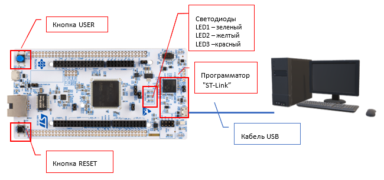

# Архитектура и программирование микроконтроллеров на примере микроконтроллера серии STM32H745

[#Введение](#введение)\
[#Подготовка рабочего места](#подготовка-рабочего-места)

## Введение
Настоящие методические указания предназначены для проведения лабораторных работ в рамах курса «Архитектура и программирование микроконтроллеров».

Целью лабораторных работ является изучение принципов работы микроконтроллеров и получение навыков разработки программного обеспечения для встраиваемых систем на примере микроконтроллера STM32.

Помимо настоящих методических указаний для выполнения лабораторных работ понадобится следующее обеспечение:
1. Персональный компьютер с операционной системой Windows/Mac/Linux и следующим программным обеспечением
   - [x] [Visual Studio Code](https://code.visualstudio.com)
   - [x] [PlatformIO](https://platformio.org)
   - [x] [Оффлайн документация  Zeal](https://zealdocs.org/) с пакетом по языкам С и С++.
2. Отладочная плата ST Nucleo-H745ZI-Q.
3. Файлы документации (доступны для скачивания на st.com):
   - [x] UM2408 – User manual. STM32H7 Nucleo-144 boards;
   - [x] RM0399 – Reference manual. STM32H745/755 and STM32H747/757 advanced Arm®-based 32-bit MCUs.

<p align="center" > </p>

<p align="center" >Рисунок 1 – Схема подключения отладочной платы к компьютеру</p>  

> ПРИМЕЧАНИЕ: Запрещается прикасаться к элементам отладочной платы, за исключением кнопок. Брать и удерживать плату следует только за её края (рёбра).

В настоящих методических указаниях предполагается англоязычный интерфейс программных средств разработки. 

В тексте методических указаний приняты следующие обозначения.
   - [x] **Совет или примечание**

> Рекомендация или подсказка, на которую следует обратить внимание.

   - [x] **Вводимые команды**

> Команды, которые вводятся в окна или терминал выделены специальным шрифтом, например: pio home

   - [x] **Названия окон, элементов интерфейса, функций.**

> Названия выделяются курсивом, например: откройте окно ***Disassembly***

   - [x] **Способы** (Для некоторых операций указаны различные способы их выполнения, например:)
       - Способ 1: нажать ALT+CTRL+B;
       - Способ 2: нажать кнопку Build в Строке состояния.

<u>Выполняя методические указания рекомендуется опробовать все предложенные способы.</u>

   - [x] **Вопросы** (Вопросы выделены специальным цветом и линией.)
     - ``` Для чего предназначены определённые в файле функции?```  

<u>При выполнении заданий необходимо делать конспект вопросов и ответов для того, чтобы быть готовым ответить на вопросы во время защиты лабораторной работы.</u>

## Подготовка рабочего места
Для выполнения работы в лабораторном классе подготовка рабочего места не требуется.

Для выполнения работ на другом компьютере необходимо установить средства разработки. На компьютере должна быть установлена операционная система Windows 10 или выше. Также можно использовать ОС Linux, однако способ установки пакетов здесь не описан.

Порядок подготовки рабочего места.
1. Установить [Visual Studio Code](https://code.visualstudio.com/download)
2. Установить драйвер программатора ST-LINK
3. Установите переменную окружения PLATFORMIO_CORE_DIR=C:\PlatformIO
4. Установить расширения: «Microsoft C/C++» и  «PlatformIO IDE».

Можно приступать к работе, сохранив доступ к сети интернет, так как инструментальные средства и библиотеки будут автоматически скачиваться устанавливаться по мере выполнения заданий. 

После первой попытки загрузки прошивки будет установлен отладчик openOCD. 

Если работы выполняется с платой Nucleo-h745zi, то для корректной необходимо в файле
.platformio\packages\tool-openocd\openocd\scripts\board\st_nucleo_h745zi.cfg закомментировать строки «set DUAL_CORE 1» и «set USE_CTI 1» и добавить строку  “set DUAL_BANK 1”

В фале tool-openocd\openocd\scripts\target\stm32h7x.cfg заменить строки
“adapter speed 4000” и “adapter speed 1800”  на adapter speed 1000
