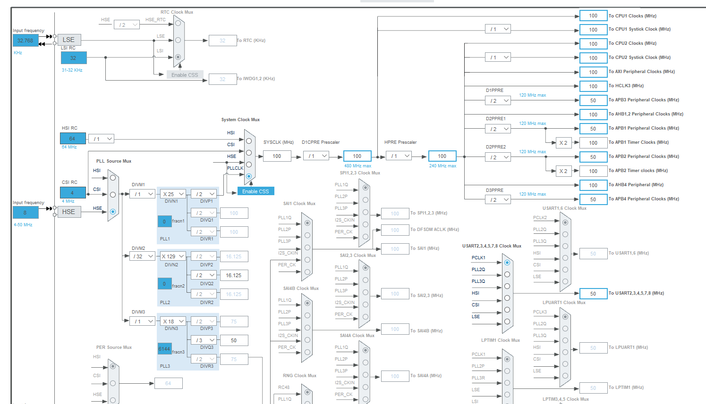
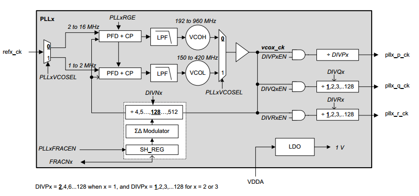
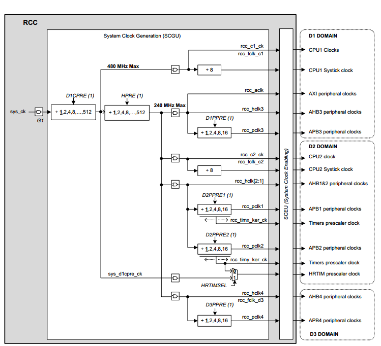

# Лабораторная работа № 2. Управление тактированием. 

[#Введение](#введение)\
[#Цели работы](#цели-работы)\
[#Контроллер сброса и тактирования (RCC)](#контроллер-сброса-и-тактирования-rcc)\
[#Алгоритм конфигурации тактовых частот](#алгоритм-конфигурации-тактовых-частот)\
[Порядок выполнения работы](#порядок-выполнения-работы)\
[- Этап 1. Создание проекта для платы NUCLEO STM32H745ZI-Q](#этап-1-создание-проекта-для-платы-nucleo-stm32h745zi-q)\
[- Этап 2. Подключение библиотеки HAL_LL](#этап-2-подключение-библиотеки-hal_ll)\
[- Этап 3. Анализ шаблона программы для выполнения задания](#этап-3-анализ-шаблона-программы-для-выполнения-задания)\
[- Этап 4. Практическое задание](#этап-4-практическое-задание)

## Введение

В настоящей лабораторной работе мы познакомимся с системой тактирования микроконтроллера.

## Цели работы
- [x] 1.	Научиться анализировать схему тактирования микроконтроллера и создавать подпрограмму конфигурации тактирования микроконтроллера.
- [x] 2.	Познакомиться и научиться использовать библиотеку HAL LL.
- [x] 3.	Закрепить навыки работы с документацией на микроконтроллер.

## Контроллер сброса и тактирования (RCC)

Котроллер RCC предназначен для управления тактированием процессорного ядра и периферийных блоков микроконтроллера. Документация RCC микроконтроллера STM32H745 приведена в RM0399 (раздел 9, стр. 351).

Увеличение частоты тактирования процессора повышает производительность вычислений, однако вместе с этим возрастет энергопотребление и тепловыделение. Поэтому необходимо устанавливать частоту работы процессора малой, но достаточной для выполнения решаемых задач. 

Производитель STM32 предлагает визуальную среду Cube Mx для конфигурации тактирования с последующим автоматической генерации кода. В настоящей работе мы не буем использовать инструмент, но научимся программировать RCC самостоятельно.

Рассмотрим источники тактовых импульсов.

МК STM32H745 имеет четыре внутренних генератора тактовой частоты:

- HSI (High-speed internal oscillator) – 64 МГц
- HSI48 (RC oscillator) – 48 МГц
- CSI (Low-power Internal oscillator) – 4 МГц
- LSI (Low-speed internal oscillator) – 32 KГц.

Также к МК подключаются внешние резонаторы (генераторы):

- HSE – от 4 до 50 МГц.
- LSE – 32.768 КГц.

На рисунке 1.1 представлена схема тактирования МК STM32H745. Процессорные ядра и шины тактируются сигналом sys_ck (системная тактовая частота, SYSCLK). После сброса МК источником SYSCLK является HSI. Однако, он может быть изменён на CSI, HSE или выходной сигнал блока PLL1 pll1_p_ck. Блоки PLL (phase-locked loop, блоки фазовой автоподстройки частоты) предназначены для преобразования частоты сигнала.

К преимуществам использования внутренних генераторов тактовой частоты является быстрая готовность к работе после подачи питания и отсутствие необходимости в использовании дополнительных электронных компонентов. Однако внутренние генераторы, могут иметь низкую стабильность частоты генерируемого сигнала, изменяющуюся вместе с температурой. А при увеличении частоты с помощью блока PLL погрешность так же увеличивается.

По включению (сбросу) МК все периферийные блоки, за исключением оперативной памяти SRAM, кэш памяти и FLASH памяти, не тактируются. Для работы с периферийным блоком необходимо включить для него тактирование шины с помощью регистра RCC_AHBxENR или RCC_APBxENR. Некоторые периферийные блоки, например USART, необходимо тактировать дополнительным сигналом, называемым «Kernel Clock».

<p align="center" > </p>

<p align="center" >Рисунок 1.1 – Схема тактирования.</p>  

После сброса микроконтроллера в качестве источника SYSCLK используется внутренний генератор HSI, а делители D1CPRE, HPRE и D1PPRE отключены.

Настройка тактирования осуществляется на начальном этапе инициализации аппаратуры МК. Также восстановление тактирования может потребоваться после выхода микроконтроллера из режима пониженного энергопотребления.

## Алгоритм конфигурации тактовых частот

- [x] 1. Необходимо определить, какая схема питания микроконтроллера используется и установить соответствующее значение в регистр PWR_CR3. Различные варианты конфигурации питания приведены в RM3099 (стр. 274 – 275). Используемая в отладочной плате конфигурация приведена в UM2408 (стр. 24). 

> При необходимости изменить профиль производительности МК (множитель напряжения ядра). По умолчанию МК работает в профиле VOS3. Профили VOS2 – VOS0 позволяют устанавливать большие частоты на периферийные блоки МК. 

> ПРИМЕЧАНИЕ: В настоящей работе режим по умолчанию VOS3 изменять не следует!

- [x] 2. При изменении системной тактовой частоты (а значит и частоты шины AXI, на которой расположена FLASH – память), необходимо установить соответствующую задержку (Flash latency), согласно таблице 16 в RM3099 (стр. 166). Для сохранения доступа к FLASH памяти задержку следует установить перед увеличением частоты SYSCLK или после уменьшения частоты SYSCLK.
- [x] 3. Включить используемый генератор-источник с помощью регистра RCC_CR1. Дождаться выхода генератора в рабочий режим, контролируя соответсвующий флаг в регистре RCC_CR1.
- [x] 4. При использовании PLL, задать источник тактирования для всех PLL (PLL Clock Source).
- [x] 5. Блок схема PLL с обозначениями регистров и сигналов приведена на рисунке 1.2. При использовании PLLx выполнить конфигурацию PLLx (p.376 RM0399).
- [x] 5.1. Установить значение пре-делителя DIVMx (от 1 до 63). 
<p align="center" >F(refx_ck) = F(PLL Clock Source) / DIVMx</p>

> F(refx_ck) должна находиться в диапазоне [1 -16] МГц.

> Здесь и далее запись «F(refx_ck)» обозначает частоту сигнала refx_ck.
Символ х обозначает номер PLL (1,2 или 3).
 
- [x] 5.2. Установить значение реигстра PLLxFRACEN = 0.
- [x] 5.3. Установить значение PLLxVCOSEL и PLLxRGE в соответсвии со значением F(refx_ck).
- [x] 5.4. Установить значение делителя DIVNx: 
<p align="center" >F(vcox_ck) = F(refx_ck) * DIVNx.</p>

> F(vcox_ck) должна находиться в диапазоне [192 - 960] МГц или [150 - 420] МГц в соответствии с заданной конфигурацией регистра PLLxVCOSEL (см. рис. 1.2)

- [x] 5.5. Установить значения делителей DIVPx, DIVQx, DIVRx: 

<p align="center" >F(pllx_p_ck) = F(vcox_ck) / DIVPx</p>

<p align="center" >F(pllx_q_ck) = F(vcox_ck) / DIVQx</p>

<p align="center" >F(pllx_r_ck) = F(vcox_ck) / DIVRx</p>

- [x] 5.6. Включить выходные сигналы DIVPxEN (pll1_p_ck)., DIVQxEN (pll1_q_ck), DIVRxEN(pll1_r_ck).
- [x] 5.7. Включить PLLx c помощью регистра RCC->CR и дождаться флага готовности PLLxRDY.

<p align="center" > </p>

<p align="center" >Рисунок 1.2 – Схема PLL микроконтроллера STM32H745</p>  

- [x] 6. Для того, чтобы изменить SYSCLK, достаточно выбрать требуемый источник. Однако, перед тем как изменить частоту SYSCLK, необходимо правильно сконфигурировать делители системных шин и других потребителей SYSCLK (см. рисунок 1.3). Важно учесть ограничения по частоте для выбранного профиля производительности (VOS), которые приведены в DSH745,табл. 23.

Для режима VOS3 имеем следующие предельные частоты:

- процессор CM7 – до 200 МГц;  
- процессор CM4 – до 100 МГц.
- шина AXI – до 100 МГц;  
- шина AHB  – до 100 МГц.
- шина APB – до 50 МГц.

Таким образом, на этом шаге необходимо установить делители D1CPRE, HPRE, D1PPRE, D2PPRE1, D2PPRE2, D3PPRE.

<p align="center" > </p>

<p align="center" >Рисунок 1.3 – Схема тактирования от SYSCLK для МК STM32H745</p>  

- [x] 7. Задать источник SYSCLK, используя поле SW регистра RCC_CFGR. Контролировать изменения параметра на заданное с помощью поля SWS того же регистра.

## Порядок выполнения работы

### Этап 1. Создание проекта для платы NUCLEO STM32H745ZI-Q

- [x] 1. Создайте проект в среде PlatformIO для платформы ststm32, платы nucleo_h745zi_q, фреймворка CMSIS и процессора CORTEX-M7. Скопируйте в папку проекта все используемые при сборке файлы (скрипт компоновщика, startup и system файлы) и «пропишите» их файле проекта.

> Способ 1. Повторить действия, описанные в Лабораторной работе №1, часть 1.

> Способ 2. Использовать проект из предыдущей работы.

- создать паку с названием проекта «group_soname_lab02» и скопировать в неё содержимое из папки проекта предыдущей лабораторной работы;
- удалить временные папки .vscode и .pio;
-	открыть VisualStudioCode и проект используя меню «File->Open Folder»;
-	удалить лишний код из файла main.c.

- [x] 2. Определите схему внешнего тактирования, используемую по умолчанию в отладочной плате Nucleo STM32H745ZI-Q (см. UM2408). Установите параметр компиляции, определив корректное значение HSE_VLAUE:

<p align="center" >-D HSE_VALUE=??????</p>  

- [x] 3. Задайте параметр компиляции, определив стандарт С11 и высокий уровень предупреждений компилятора:

<p align="center" >-std=c11 -Wall -Wextra</p>  

- [x] 4. Добавьте в проект библиотеку управления светодиодами из лабораторной работы №1.

### Этап 2. Подключение библиотеки HAL_LL

Файлы библиотеки HAL находятся в каталоге *C:\PlatformIO\packages\framework-stm32cubeh7\Drivers\STM32H7xx_HAL_Driver.* Библиотека HAL_LL входит в состав бибилиотеки HAL, однако может использоваться отдельно. 

Библиотека HAL_LL имеет модульную структуру. Каждый модуль библиотеки HAL_LL представлен двумя файлами  ¬-  заголовочный и исполняемый файл. Например, модуль для управления блоком RCC состоит из файлов: stm32h7xx_ll_rcc.h и stm32h7xx_ll_rcc.с.  Файлы бибилиотеки HAL_LL имеют префикс hal_ll.

В проект можно добавить все модули HAL_LL. Однако, для того, чтобы сократить время сборки проекта, предлагается включить в проект только те модули, которые планируется использовать.

Большинство модулей библиотеки HAL_LL самодостаточны, т.е. не зависят от других модулей. Однако, если такая зависимость имеется, то её легко отследить по включениям include в заголовочном файле модуля. 

- [x] 1. Создайте каталоги *$PROJECT_DIR/lib/hal_ll/src* и *$PROJECT_DIR/lib/hal_ll/include*

> Здесь и далее $PROJECT_DIR обозначает каталог проекта.

- [x] 2. Поместите в созданные папки файлы библиотеки HAL в соответсвии с таблицей:

|    Модуль    | $PROJECT_DIR/lib/hal_ll/src | $PROJECT_DIR/lib/hal_ll/include |
|    :---:     |           :---:             |             :---:               |
|   UTILS LL   |    stm32h7xx_ll_utils.c     |     stm32h7xx_ll_utils.h        |
|   RCC LL     |    stm32h7xx_ll_rcc.c       |      stm32h7xx_ll_rcc.h         |
|   PWR LL     |    stm32h7xx_ll_pwr.c       |      stm32h7xx_ll_pwr.h         |
|   BUS LL     |             –               |      stm32h7xx_ll_bus.h         |
|  CORTEX LL   |             –               |     stm32h7xx_ll_cortex.h       |
|  SYSTEM LL   |             –               |     stm32h7xx_ll_system.h       |

- [x] 3. 	Создайте в каталоге *$PROJECT_DIR/lib/hal_ll* файл описания библиотеки *library.json.*  В файле зададим название библиотеки и снимем флаги для строгого вывода предупреждений, так как мы уверены в корректности библиотеки не собираемся её изменять. 

*Листинг 1.2 – файл  $PROJECT_DIR/lib/hal_ll/library.json*

<p align="center" > </p>

- [x] 4. Добавьте в файл platform.io флаг компиляции

<p align="center" >-D USE_FULL_LL_DRIVER</p>  

Этот флаг активирует определение всех функций и структур библиотеки HAL LL.

### Этап 3. Анализ шаблона программы для выполнения задания

- [x] 1. Создайте файл *main.c* в папке *src* проекта и скопируйте в него листинг 1.2.

*Листинг 1.2 – $PROJECT_DIR/src/main.c*

``` C++
#include <stm32h7xx_ll_rcc.h>
#include <stm32h7xx_ll_pwr.h>
#include <stm32h7xx_ll_utils.h>
#include <stdio.h>
#include <assert.h>
#include <string.h>
#include <led.h>

#define VARIANT 1
#define NUM_VARIANTS 2
#ifndef VARIANT
    #error "You must define VARIANT"
#endif
#if VARIANT > NUM_VARIANTS
    #error "Unexpected VARIANT"
#endif

#define MHZ(VAL) VAL ## 000000
#define KHZ(VAL) VAL ## 000
const LL_RCC_ClocksTypeDef expected_clocks[NUM_VARIANTS] = {
    //  { SYSCLK,   CPUCLK,  HCLK,    APB1,     APB2,     APB3,    APB4  
        { MHZ(128), MHZ(64), MHZ(32), MHZ(16),  MHZ(16),  MHZ(16),  MHZ(16)},
        { MHZ(3),   MHZ(3),  MHZ(3),  KHZ(1500), KHZ(1500), KHZ(1500), KHZ(1500) } };
const uint32_t expected_pll_source[NUM_VARIANTS] = { LL_RCC_PLLSOURCE_HSE, LL_RCC_PLLSOURCE_CSI };
const uint32_t expected_fl[NUM_VARIANTS] = { 2, 0 };

void safe_clock() {
    uint32_t sw = RCC_CFGR_SW_HSI;
    uint32_t sws = 0;
    MODIFY_REG(RCC->CFGR, RCC_CFGR_SW_Msk, sw);
    do {
        sws = (RCC->CFGR & RCC_CFGR_SWS_Msk) >> RCC_CFGR_SWS_Pos;
    } while (sws != sw);
}

void __assert_func(const char* file, int line, const char* func, const char* failedexpr) {
    (void)file;
    (void)func;
    (void)failedexpr;
    (void)line;
    RCC->AHB4ENR |= RCC_AHB4ENR_GPIOBEN;
    MODIFY_REG(GPIOB->MODER, GPIO_MODER_MODE14, GPIO_MODER_MODE14_0);
    GPIOB->BSRR = GPIO_BSRR_BS14;
    safe_clock();
    __asm("bkpt 1");
    while (1);
}

void FIXED_RCC_GetSystemClocksFreq(LL_RCC_ClocksTypeDef* RCC_Clocks) {
    assert(RCC_Clocks);
    switch (LL_RCC_GetSysClkSource())
    {
    case LL_RCC_SYS_CLKSOURCE_STATUS_HSI:
        RCC_Clocks->SYSCLK_Frequency = HSI_VALUE >> (LL_RCC_HSI_GetDivider() >> RCC_CR_HSIDIV_Pos);
        break;
    case LL_RCC_SYS_CLKSOURCE_STATUS_CSI:
        RCC_Clocks->SYSCLK_Frequency = CSI_VALUE;
        break;
    case LL_RCC_SYS_CLKSOURCE_STATUS_HSE:
        RCC_Clocks->SYSCLK_Frequency = HSE_VALUE;
        break;
    case LL_RCC_SYS_CLKSOURCE_STATUS_PLL1: {
        LL_PLL_ClocksTypeDef PLL_Clocks;
        LL_RCC_GetPLL1ClockFreq(&PLL_Clocks);
        RCC_Clocks->SYSCLK_Frequency = PLL_Clocks.PLL_P_Frequency;
    } break;
    default:
        RCC_Clocks->SYSCLK_Frequency = 0;
    };
    uint32_t d1cpre = (RCC->D1CFGR >> 8);
    if (d1cpre & 8) {
        uint32_t div_val = 1 << ((d1cpre & 7) + 1);
        RCC_Clocks->CPUCLK_Frequency = RCC_Clocks->SYSCLK_Frequency / div_val;
    }
    else {
        RCC_Clocks->CPUCLK_Frequency = RCC_Clocks->SYSCLK_Frequency;
    }
    RCC_Clocks->HCLK_Frequency = LL_RCC_CALC_HCLK_FREQ(RCC_Clocks->CPUCLK_Frequency, LL_RCC_GetAHBPrescaler());
    RCC_Clocks->PCLK1_Frequency = LL_RCC_CALC_PCLK1_FREQ(RCC_Clocks->HCLK_Frequency, LL_RCC_GetAPB1Prescaler());
    RCC_Clocks->PCLK2_Frequency = LL_RCC_CALC_PCLK2_FREQ(RCC_Clocks->HCLK_Frequency, LL_RCC_GetAPB2Prescaler());
    RCC_Clocks->PCLK3_Frequency = LL_RCC_CALC_PCLK3_FREQ(RCC_Clocks->HCLK_Frequency, LL_RCC_GetAPB3Prescaler());
    RCC_Clocks->PCLK4_Frequency = LL_RCC_CALC_PCLK4_FREQ(RCC_Clocks->HCLK_Frequency, LL_RCC_GetAPB4Prescaler());
}

void assert_student_task(int num_variant) {
    assert(num_variant > 0 && num_variant <= NUM_VARIANTS);
    int i = num_variant - 1;
    static LL_RCC_ClocksTypeDef clocks = { 0 };
    FIXED_RCC_GetSystemClocksFreq(&clocks);
    assert(memcmp(&expected_clocks[i], &clocks, sizeof(LL_RCC_ClocksTypeDef)) == 0);
    assert(expected_pll_source[i] == LL_RCC_PLL_GetSource());
    assert(expected_fl[i] == LL_FLASH_GetLatency());
}

void configurate_clock() {
    // 1. Настройка параметров питания. // RM0399:p.276
    LL_PWR_ConfigSupply(LL_PWR_DIRECT_SMPS_SUPPLY); // UM2408 - p24; RM0399 - p.274-275; ds - p.25
    LL_PWR_SetRegulVoltageScaling(LL_PWR_REGU_VOLTAGE_SCALE3);
    while (LL_PWR_IsActiveFlag_VOS() == 0) {}

    // 2. Настройка Lattency для FLASH. // RM0399:p.166; DS745:p.25
    // Hint: LL_FLASH_SetLatency 

    // 3. Включить генератор и дождаться готовности // RM0399:p.366
    // Для HSE не забыть вызывать LL_RCC_HSE_EnableBypass();    
    
    // 4. Установка источника тактирования для PLL (PLL Source Mux)
    // Hint: LL_RCC_PLL...

    // 5. Конфигурации PLL1; RM-p.365 (структура) p.376 (алгоритм)

    // 5.1. установить значение пре-делителя DIVMx

    // 5.2.установить значение регистра PLLxFRACEN = 0

    // 5.3.установить значение PLLxVCOSEL и PLLxRGE в соответсвии со значением rfx_ck
    // Hint: LL_RCC_PLL1_SetVCOOutputRange & LL_RCC_PLL1_SetVCOInputRange

    // 5.4.установить значения делителя DIVNx: F(vcox_ck) = F(refx_ck) * DIVNx
    
    // 5.5. установить значения делителей DIVPx, DIVQx, DIVRx: F(pllx_p_ck) = F(vcox_ck) * DIVPx, ...
    
    // 5.6.Включить выходные сигналы DIVPxEN(pll1_p_ck), DIVQxEN(pll1_q_ck), DIVRxEN(pll1_r_ck).

    // 5.7.Включить PLLx c помощью регистра RCC->CR 

    // и дождаться флага готовности PLLxRDY.
    while (LL_RCC_PLL1_IsReady() == 0) {}

    // 6. Конфигурация делителей системный шин D1CPRE, HPRE, D1PPRE, D2PPRE2, D3PPRE
    // Hint: LL_RCC_SetSysPrescaler LL_RCC_SetAHBPrescal eLL_RCC_SetAPB..

    // 7. Задаем источник System Clock

    // и дождаться установки выбранного режима
    // hint: while (LL_RCC_GetSysClkSource() != ???);
}

int main() {
    configurate_clock();
    assert_student_task(VARIANT);
    SystemCoreClockUpdate();
    LL_Init1msTick(SystemCoreClock);
    led_green_enable();
    while (1) {
        led_green_toggle();
        LL_mDelay(500);
    }
    return 0;   
}
```
- [x] 2. Выполните сборку проекта. Убедитесь в отсутствии ошибок.
- [x] 3. Проанализируйте код main.c


```В1. Каким образом выполняется конкатенация в макросах С?```

```В2. Как использовать функцию assert() из стандарта C в проектах для встраиваемых систем?```

```В3. Что произойдет при прохождении (не прохождении) функции assert_student_task()?```

### Этап 4. Практическое задание.

- [x] 1. Установите значение макроопределения VARIANT (строка 10) в соответствии в Вашим вариантом задания.
- [x] 2. Реализуйте функцию configurate_clock(), для конфигурации тактировании микроконтроллера в соответствии c вариантом.

|                Параметр               | Вариант 1 | Вариант 2  |
|                 :---:                 |   :---:   |    :---:   |
|             Источник PLL              |    HSE    |     CSI    |
|   Системная тактовая частота (SYSCLK) |  128 МГц  |    3 МГц   |
|     Частота ядра CortexM7 (CPUCLK)    |   64 МГц  |    3 МГц   |
|      Частота шин AXI и AHB (HCLK)     |   32 МГц  |    3 МГц   |
|     Частота шин APB1 – APB4 (PCLK)    |   16 МГц  |   1.5 MГц  |

При корректной реализации функции на плате должен мигать зеленый светодиод. 

Если полученная конфигурация не верна, то будет гореть красный светодиод. Проведите отладку функции *assert_student_task*, чтобы узнать какая частота не соответствует заданию.

Если светодиоды не горят, то, вероятно, программа зависла в цикле ожидания. Проверьте это с помощью отладчика.