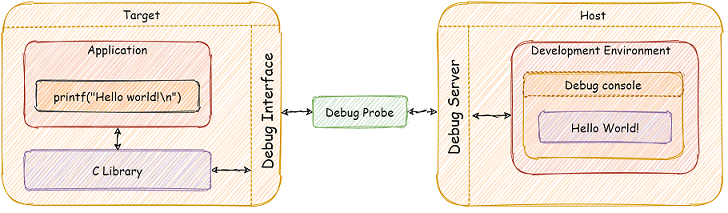
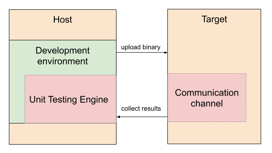
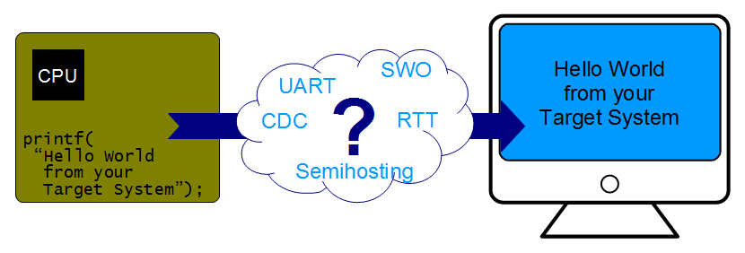
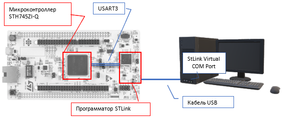
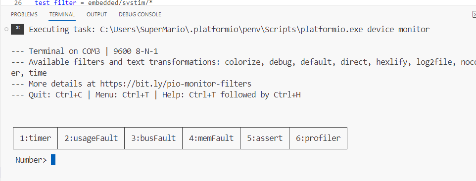

# Лабораторная работа №3. Ввод-вывод между целевой и хост машинами. Системный таймер. Обработка исключений.

[#Введение](#введение)\
[#Цели работы](#цели-работы)\
[#Порядок выполнения работы](#порядок-выполнения-работы)\
[#Алгоритм конфигурации тактовых частот](#алгоритм-конфигурации-тактовых-частот)\
[Порядок выполнения работы](#порядок-выполнения-работы)\
[- Этап 1. Создание проекта для платы NUCLEO STM32H745ZI-Q](#этап-1-создание-проекта-для-платы-nucleo-stm32h745zi-q)\
[- Этап 2. Инициализация, приём и передача символов через UART](#этап-2-инициализация-приём-и-передача-символов-через-uart)\
[- Этап 3. Подключение стандартного вывода к UART](#этап-3-подключение-стандартного-вывода-к-uart)\
[- Этап 4. Прием данных по из UART](#этап-4-прием-данных-по-из-uart)\
[- Этап 5. Проверка работы ввода-вывода](#этап-5-проверка-работы-ввода-вывода)\
[Задания для самостоятельного выполнения](#задания-для-самостоятельного-выполнения)\
[- Задание 1. Реализация обработчиков исключений отказов](#задание-1-реализация-обработчиков-исключений-отказов)\
[- Задание 2. Создание библиотеки системного таймера и профилирования](#задание-2-создание-библиотеки-системного-таймера-и-профилирования)\
[- Задание 3. Измерение времени расчета контрольной суммы](#задание-3-измерение-времени-расчета-контрольной-суммы)

## Введение

Для разработки встроенного программного обеспечения используется отладчик, с помощью которого можно отслеживать состояние микроконтроллера и ход выполнения программы «по шагам».

Еще одним полезным инструментом является вывод сообщений от целевым устройства (микроконтроллера) в консоль хост-компьютера (компьютера разработчика). Этот метод позволяет отслеживать поведение программы, не прерывая поток выполнения программы. Обеспечивается возможность использовать функции стандартного вывода (например, printf()) на целевом устройстве и просмотра выводимой информации непосредственно в консоли отладки без какого-либо дополнительного оборудования.

<p align="center" > </p>

<p align="center" >Рисунок 1.1 – ARM Semihosting</p>  

Таким образом, мы можем делегировать некоторые части функциональности приложения (например, работу с клавиатурой, печать на дисплее, файловый ввод-вывод и т. д.) хост-машине. Если обеспечить дополнительно не только вывод, но и ввод сообщений, то появляется возможность организовать автоматизированное модульное тестирование на целевой аппаратуре, ввод запросов, переключение режимов и другой функционал.

<p align="center" > </p>

<p align="center" >Рисунок 1.2 – Модульное тестирование встраиваемой системы.</p>  

Существуют несколько способов организации ввода-вывода между целевой машиной и хост-компьютером: 

- ARM Semihosting - передача сообщений в консоль отладчика с помощью программатора (Debug Probe);
- перенаправление через UART и виртуальный COM -порт хост-компьютера.
- технология Serial Wire View (SWV), обеспечивающая быстрый однонаправленный вывод через линию SWO.
- коммерческие решения, например Real Time Transfer (RTT), работающие со специализированным программатором компании SEGGER.

<p align="center" > </p>

<p align="center" >Рисунок 1.3 – Способы организации ввода-вывода.</p>  

Более подробную информацию о различных технологиях семихостинга при разработке программ для STM32 можно почерпнуть в [1].


## Цели работы

В настоящей работе мы реализуем ввод-вывод между отладочной платой 
STM32H745ZI-Q и компьютером с помощью виртуального COM порта, встроенного в программатор ST-LinkV3. Этот способ сопряжения не требует дополнительного оборудования и кабелей для коммутации между отладочной платdой компьютером. 

Во второй части мы используем этот механизм для решения задач обработки исключений и профилирования кода с помощью системного таймера.

<p align="center" > </p>

<p align="center" >Рисунок 1.4 – Схема организации ввода-вывода.мы.</p>  

## Порядок выполнения работы

### Этап 1. Создание проекта для платы NUCLEO STM32H745ZI-Q

1. Создайте проект в среде PlatformIO  для платформы ststm32, платы nucleo_h745zi_q, фреймворка CMSIS и процессора CORTEX-M7. 
2. Скопируйте в папку проекта все используемые при сборке системные файлы (скрипт компоновщика, startup и system файл) и «пропишите» их файле проекта.
3. Задайте флаги компиляции:

<p align="center" >-D CORE_CM7 -D HSE_VALUE=8000000 -std=c11 -Wall -Wextra</p>

> Создание проекта рассмотрено в лабораторных работах 1 и 2.

### Этап 2. Инициализация, приём и передача символов через UART 

Интерфейс UART3 подключен к встроенному программатору ST-LinkV3 и далее к виртуальному COM-порту для соединения с хост-компьютером по интерфейсу USB. Поэтому необходимо инициализировать и настроить приёмопередатчик UART3 микроконтроллера, использующий порты ввода вывода PD8 (линия TX) и PD9 (линия RX). Для тактирования UART3 выбран внутренний генератор HSI. Следовательно, конфигурация скорости интерфейса не будет завесить от конфигурации частоты тактирования ядер и шин микроконтроллер. 

1. Создайте файл vterm.c и поместите в него код функции инициализации приёмопередатчика UART3 и передачи символа в UART3 (листинг 1.1). 

2. Изучите код и комментарии, чтобы понять алгоритмы настройки приёмопередатчика и функции передачи и приёма байта данных. 

*Листинг 1.1 – vterm.c*

``` C++
#include "vterm.h"
#include "stm32h7xx.h"
#include "stm32h745xx.h"
#include <stdio.h>  

#ifndef HSI_VALUE
#define HSI_VALUE 64000000U
#endif

/**
 * @brief Инициализации UART3 
 * @note  PD8(AF7)->USART3_TX,  PD9(AF7)->USART3_RX; kernel сlock = HSI
 * @param baudrate скорость работы
 */
static void uart3_init(int baudrate)
{
  // Назначаем USART3 ядру CM7 и включаем тактирование
  SET_BIT(RCC_C1->APB1LENR, RCC_APB1LENR_USART3EN);
  // Выбираем HSI для Kernel clock 
  MODIFY_REG(RCC->D2CCIP2R, RCC_D2CCIP2R_USART28SEL_0, RCC_D2CCIP2R_USART28SEL_0 | RCC_D2CCIP2R_USART28SEL_1);
  
  // Включаем тактирование GPIOD 
  SET_BIT(RCC_C1->AHB4ENR, RCC_AHB4ENR_GPIODEN_Msk);
  // Режим альт. функции для PD8 и PD9
  MODIFY_REG(GPIOD->MODER, GPIO_MODER_MODE8_Msk | GPIO_MODER_MODE9_Msk,
    GPIO_MODER_MODE8_1 | GPIO_MODER_MODE9_1);
  // Назначем номер альт. функции PD8 и PD9, соотв. USART3 
  MODIFY_REG(GPIOD->AFR[1], GPIO_AFRH_AFSEL8 | GPIO_AFRH_AFSEL9,
    GPIO_AFRH_AFSEL8_0 | GPIO_AFRH_AFSEL8_1 | GPIO_AFRH_AFSEL8_2 |
    GPIO_AFRH_AFSEL9_0 | GPIO_AFRH_AFSEL9_1 | GPIO_AFRH_AFSEL9_2);
  // Режим "PushPull" для TX
  CLEAR_BIT(GPIOD->OTYPER, GPIO_OTYPER_OT8_Msk);
  // Без подтягивающих резисторов pull-up/pull-down на TX и RX
  MODIFY_REG(GPIOD->PUPDR, GPIO_PUPDR_PUPD8_Msk | GPIO_PUPDR_PUPD9_Msk, 0);
  // "Medium speed" для порта TX
  MODIFY_REG(GPIOD->OSPEEDR, GPIO_OSPEEDR_OSPEED8_Msk, GPIO_OSPEEDR_OSPEED8_0);

  // Настройка UART: 8-bit data, no parity, 1 stop bit, oversampling; enabling tx+rx
  MODIFY_REG(USART3->CR1, USART_CR1_TE | USART_CR1_RE, USART_CR1_TE | USART_CR1_RE);
  // Пределитель клока HSI/8 (8 МГц)
  MODIFY_REG(USART3->PRESC, USART_PRESC_PRESCALER, USART_PRESC_PRESCALER_2);
  // Конфигурация скорости приёмопередатчика
  USART3->BRR = HSI_VALUE / 8 / baudrate;
  // Отключаем детекцию и ошибки переполнения.
  USART3->CR3 |= USART_CR3_OVRDIS;

  // Включаем USART3
  USART3->CR1 |= USART_CR1_UE;
  while ( (USART3->ISR & USART_ISR_TEACK_Msk) == 0);
  while ( (USART3->ISR & USART_ISR_REACK_Msk) == 0);
}

/**
 * @brief Передача одного символа в UART3
 */
static inline void uart3_putch(char ch) {
  // Ожидание готовности регистра выходных данных и завершения передачи 
  while ((USART3->ISR & USART_ISR_TXFE) != 0 || (USART3->ISR & USART_ISR_TC) == 0);
  USART3->TDR = ch;
}

/**
 * @brief Приём одного символа из UART3
 */
static inline char uart3_getch() {
  // Ожидание готовности регистра выходных данных и завершения передачи 
  while ((USART3->ISR & USART_ISR_RXNE_RXFNE) == 0);
  return (USART3->RDR) & 0xFF;
}
```

#### Этап 3. Подключение стандартного вывода к UART

1. Компилятор arm-none-eabi-gcc используется библиотеку Newlib для реализации стандартной библиотеки языка C и процедур времени выполнения (Runtime routines). Система сборки PlatformIO автоматически подключает эту библиотеку, а также библиотеку nosys (флаг компоновки -–specs=nosys.specs). Скрипт компоновщика и стартап-скрипт, заимствованный из библиотеки CMSIS, содержат все необходимые определения и вызовы для работы библиотеки Newlib.

2. Библиотека nosys содержит реализацию системных функций, которые обычно выполняются операционной системой через системные вызовы. Реализация выполнена в виде заглушек – функции не выполняют практической работы и возвращают код ошибки. При этом функции определены с атрибутом слабого связывания (weak). Поэтому, если реализовать функцию с такой же сигнатурой в своём коде, то компоновщик заменит функцию-заглушку из библиотеки nosys, на созданную реализацию.

Чтобы обеспечить обработку операций вывода необходимо реализовать функцию _write(). Добавьте её реализацию в  файл vterm.c.

*Листинг 1.2*

``` C++
int _write(int file, char* ptr, int len) {
  (void)file;
  int i = 0;
  while (i < len) {
    uart3_putch(ptr[i]);
    i++;
  }
  return i;
}
```

3. Создайте файл vterm.h и поместите в него объявление функции  инициализации

<p align="center" >void vterm_init(int baudrate)</p>

4. Функция *vterm_init()* выполняет инициализацию USART3 и отключает буферизацию в процедурах стандартного ввода-вывода. Таким образом, нам не надо будет заботиться об обработке буферизированных данных. Все функции стандартного вывода будут сразу же вызывать функцию _write(). 

Добавьте реализацию *vterm_init()* в  файл vterm.c.   

*Листинг 1.3 – vterm_init()*

``` C++
/**
* @brief Настройка семихостинга c UART3.
*/
void vterm_init(int baudrate) {
  uart3_init(baudrate);
  setvbuf(stdin, NULL, _IONBF, 0);
  setvbuf(stdout, NULL, _IONBF, 0);
  setvbuf(stderr, NULL, _IONBF, 0);
}
```

#### Этап 4. Прием данных по из UART

1. Также, как и со стандартным выводом, для стандартного ввода можно реализовать функцию _read().  Однако, в настоящей лабораторной работе применим более простое решение.  Добавьте в файл vterm.h объявление функции

<p align="center" >int vterm_gets(char* buf, int size)</p>

2. Добавьте её реализацию в  файл vterm.c.

*Листинг 1.4 – vterm_gets()*

``` C++
/**
 * @brief Чтение строки из терминала в буфер
 * @note Чтение завершается при считывании символа перевода строки 
 * или возврата каретки или при заполнении буфера. 
 * Данные дополняются символом конца строки.
 * @param buf - буфер
 * @param size - размер буфера
 * @return длина считаной строки
 */
int vterm_gets(char* buf, int size) {
  if (size == 0) return 0;
  int i = 0;
  while (i < size-1) {
    char ch = uart3_getch();
    USART3->TDR = ch; // Echo to terminal
    if (ch == '\n' || ch == '\r') {
      break;
    }
    buf[i] = ch;
    i++;
  }
  buf[i] = '\0';
  return i;
}
```

#### Этап 5. Проверка работы ввода-вывода

1. Создайте файл main.c и поместите в него шаблон программы, для демонстрации и проверки работы ввода-вывода (листинг 1.5).  

2. Ознакомьтесь с текстом программы, чтобы понять логику её работы.

*Листинг 1.5 – main.c*

``` C++
#include <stdio.h>
#include <assert.h>
#include <stm32h7xx.h>
#include <vterm.h>

#define VTERM_SPEED 9600
#define NUM_COMMANDS 6

static const char* gc_greeting_msg = "\n\r\n\rHello world!";
static const char* gc_help_msg =
"\n\r"
"\n\r┌─────────┬──────────────┬────────────┬────────────┬──────────┬────────────┐"
"\n\r│ 1:timer │ 2:usageFault │ 3:busFault │ 4:memFault │ 5:assert │ 6:profiler │"
"\n\r└─────────┴──────────────┴────────────┴────────────┴──────────┴────────────┘"
"\n\r Press number> ";

void do_timer() {
    // TODO: Вывести время работы с момента Reset
}

void do_usageFault() {
    // TODO: деление на ноль или доступ к невыровненным данным
}

void do_memFault() {
    // Попытка выполнения кода из области памяти для переферийных устройств
    void* ptr = (void*)0x40000000;
    goto* ptr;
}

void do_busFault() {
    // TODO чтение из отсутствующей внешней памяти (0х60000000)
}

void do_assert() {
    assert(!"Assertion example");
}

void do_profiler() {
    // Измерить и вывести время расчета CRC32
}

typedef void (*handler_func_t)();

handler_func_t handlers[NUM_COMMANDS] = { do_timer, do_usageFault,
   do_busFault, do_memFault, do_assert, do_profiler };

uint8_t read_command() {
    char str[2];
    vterm_gets(str, 2);
    return str[0] >= '1' ? str[0] - '1' : UINT8_MAX;
}

int main() {
    SystemCoreClockUpdate();
    vterm_init(VTERM_SPEED);
    printf("%s (clock is %ld KHz)", gc_greeting_msg, SystemCoreClock / 1000);
    for (;;) {
        printf(gc_help_msg);
        uint8_t handler_num = read_command();
        if (handler_num < NUM_COMMANDS) {
            handlers[handler_num]();
        }
    }
    return 0;
}
```

3. Выполните сборку программы. Убедитесь в отсутствии ошибок. Запишите программу в микроконтроллер.

4. На хост компьютере можно использовать любую программу-терминал, например *TerraTerm*. При этом корректного обмена сообщениями указать параметры обмена. Функция *vterm_init()* конфигурирует порт с параметрами «9600-8-N-1», которые используются по умолчанию в большинстве программ-терминалов – скорость обмена 9600 бод/с, 8 информационный бит, без бита четности и один стоповый бит. Также программе-терминалу необходимо указать номер используемого COM порта в операционной системе хост-компьютера. Порт программатора STLink имеет название «STMicroelectronics STLink Virtual COM Port», а его номер можно просмотреть в Диспетчере устройств (для ОС Windows).

В среда разработки PlatformIO имеется встроенный терминал, называемый Serial Monitor, для связи с целевым устройством по последовательному порту. Его конфигурацию можно установить в файле проекта *platformio.ini*. Добавьте параметр:  

<p align="center" >monitor_speed = 9600</p>

5. Запустите Serial Monitor

> Способ 1: Нажмите на кнопку Serial Montor в строке состояния.

> Способ 2: нажмите CTRL+ALT+S

> Способ 3: введите команду PlatformIO: Serial Monitor

Появится новое окна Терминала «Monitor Task»

> В один момент времени может быть запущен только один терминал.

В окне терминала нажмите пробел. Наблюдайте вывод запроса команды (рис. 1.5).

<p align="center" > </p>

<p align="center" >Рисунок 1.5 – Окно терминала Serial Monitor .</p>  

## Задания для самостоятельного выполнения

### Задание 1. Реализация обработчиков исключений отказов

1. Создайте файл fault_handlers.h.

*Листинг 1.6 – fault_handlers.h*

``` C++
#pragma once
void enable_fault_handlers();
```

2. Создайте файл fault_handlers.c (листинг 1.7). 

*Листинг 1.7 – fault_handlers.с*

``` C++
#include "fault_handlers.h"
#include "stm32h7xx.h"
#include "stm32h745xx.h"
#include <stdio.h>

void enable_fault_handlers() {
    // Включить генерацию исключений при длении на ноль
    // cм. PM0253, п. 4.3.7 на стр. 200
    // SCB->CCR ....

    // Разрешить генерацию исключений
    // см. PM0253, п. 4.3.9 на стр. 204
    // SCB->SHCSR ...
}

//  PM0253, стр 205-206 и 211.
void MemManage_Handler() {
    puts("\n\rMemManage exception!");
    uint32_t mmfsr = (SCB->CFSR) & 0xFF;
    printf("MMFSR = 0x%lx\n\r", mmfsr);
    if (mmfsr & 0x80)
        printf("MMFAR = 0x%lx\n\r", (SCB->MMFAR));
    __asm("bkpt 1");
    NVIC_SystemReset();
}
```

3. Листинг 1.7 содержит обработчик прерывания *Memory Management Fault.* Обратите внимание на использование функции printf(), которая может выводить как строки, так и форматированные целочисленные значения.

4. Реализуйте функцию *enable_fault_handlers().*

5. В файле fault_handlers.c напишите обработчик исключений *Bus Fault*, который выводит сообщение «BusFault Exception!», значение регистра BFSR, а также регистр BFAR, если он содержит актуальный адрес.  В завершении обработки выполнить перезагрузку микроконтроллера.

6. В файле fault_handlers.c напишите обработчик исключений *Usage Fault*, который выводит сообщение «UsageFault Exception!», значение регистра UFSR  и выполняет перезагрузку микроконтроллера.

7. В файле fault_handlers.c напишите обработчик исключений Hard Fault_Handler, который выводит сообщение «Hard Fault_Handler», значение регистра HFSR  и выполняет перезагрузку микроконтроллера.

8. В файле main.c  реализуйте функции *do_usageFault()* и *do_busFault()*, в которых выполнить операции приводящие к соответствующим отказам.

9. В функции *main()* активируйте обработку исключений до запуска основного цикла.

10. Соберите и выполните полученную программу на отладочной плате. Проверьте обработку исключений BusFault, MemoryFault и UsageFault, вводя соответствующие команды в  терминал *Serial Monitor*.

### Задание 2. Создание библиотеки системного таймера и профилирования

1. Создайте файл systim.h (листинг 1.8) c объявлениями функций библиотеки.

*Листинг 1.8 – systim.h*

``` C++
#pragma once
#include <stdint.h>
#define SYSTIM_PROPRITY 0xF

// Инициализация 1-мс системного таймера
void systim_init(uint32_t mcu_clock);

// Возвращает счетчик миллисекунд с момента инициализации
uint32_t systim_current_ms();

// Возвращает кол-во милисекунд с момента FROM
// from - значение systim_current_ms() в момент FROM;
uint32_t systim_elapsed_ms(uint32_t from);

// Активное ожидание не менее ms милисекунд
void systim_delay_ms(uint32_t ms);

// Активное ожидание не менее mсs микросекунд
void systim_delay_mcs(uint32_t mcs);
```

2. Создайте файл systim.c (листинг 1.9) для реализации функций библиотеки. 

3. Доработайте функцию *systim_init()* и реализуйте все остальные функции, объявленные в файле systim.h, используя CMSIS.

4. В фале main.c доработайте функцию – обработчик do_timer() таким образом, чтобы она выводила время работы программа с момента сброс микроконтроллера.

*Листинг 1.9 – systim.с*

``` C++
#include <stm32h7xx.h>
#include <stm32h745xx.h>
#include <assert.h>
#include "systim.h"

static volatile uint32_t g_sys_counter_ms = 0;
static uint32_t g_ticks_in_mcs = 0;

void SysTick_Handler() {
    g_sys_counter_ms += 1;
}

void systim_init(uint32_t mcu_clock) {
    assert(mcu_clock > 1000000U);
    g_ticks_in_mcs = mcu_clock / 1000000U;
    // PM0253, раздел 4.4, стр 212.
    // TODO Запус SysTick
}
```

### Задание 3. Измерение времени расчета контрольной суммы

1. В листинге 1.10 приведены 3 различных функции расчета CRC32. Функция *calculate_CRC32_SW()* использует только процессора, а функции *calculate_CRC32_HW_8bit()* и *calculate_CRC32_HW_32bit()* используют аппаратный блок расчета CRC.

*Листинг 1.10 – crc32.h*

``` C++
#include "crc32.h"
#include <stm32h7xx.h>
#include <stm32h745xx.h>
static const uint32_t crc_table[0x100] = {
  0x00000000, 0x04C11DB7, 0x09823B6E, 0x0D4326D9, 0x130476DC, 0x17C56B6B, 0x1A864DB2, 0x1E475005,
  0x2608EDB8, 0x22C9F00F, 0x2F8AD6D6, 0x2B4BCB61, 0x350C9B64, 0x31CD86D3, 0x3C8EA00A, 0x384FBDBD,
  0x4C11DB70, 0x48D0C6C7, 0x4593E01E, 0x4152FDA9, 0x5F15ADAC, 0x5BD4B01B, 0x569796C2, 0x52568B75,
  0x6A1936C8, 0x6ED82B7F, 0x639B0DA6, 0x675A1011, 0x791D4014, 0x7DDC5DA3, 0x709F7B7A, 0x745E66CD,
  0x9823B6E0, 0x9CE2AB57, 0x91A18D8E, 0x95609039, 0x8B27C03C, 0x8FE6DD8B, 0x82A5FB52, 0x8664E6E5,
  0xBE2B5B58, 0xBAEA46EF, 0xB7A96036, 0xB3687D81, 0xAD2F2D84, 0xA9EE3033, 0xA4AD16EA, 0xA06C0B5D,
  0xD4326D90, 0xD0F37027, 0xDDB056FE, 0xD9714B49, 0xC7361B4C, 0xC3F706FB, 0xCEB42022, 0xCA753D95,
  0xF23A8028, 0xF6FB9D9F, 0xFBB8BB46, 0xFF79A6F1, 0xE13EF6F4, 0xE5FFEB43, 0xE8BCCD9A, 0xEC7DD02D,
  0x34867077, 0x30476DC0, 0x3D044B19, 0x39C556AE, 0x278206AB, 0x23431B1C, 0x2E003DC5, 0x2AC12072,
  0x128E9DCF, 0x164F8078, 0x1B0CA6A1, 0x1FCDBB16, 0x018AEB13, 0x054BF6A4, 0x0808D07D, 0x0CC9CDCA,
  0x7897AB07, 0x7C56B6B0, 0x71159069, 0x75D48DDE, 0x6B93DDDB, 0x6F52C06C, 0x6211E6B5, 0x66D0FB02,
  0x5E9F46BF, 0x5A5E5B08, 0x571D7DD1, 0x53DC6066, 0x4D9B3063, 0x495A2DD4, 0x44190B0D, 0x40D816BA,
  0xACA5C697, 0xA864DB20, 0xA527FDF9, 0xA1E6E04E, 0xBFA1B04B, 0xBB60ADFC, 0xB6238B25, 0xB2E29692,
  0x8AAD2B2F, 0x8E6C3698, 0x832F1041, 0x87EE0DF6, 0x99A95DF3, 0x9D684044, 0x902B669D, 0x94EA7B2A,
  0xE0B41DE7, 0xE4750050, 0xE9362689, 0xEDF73B3E, 0xF3B06B3B, 0xF771768C, 0xFA325055, 0xFEF34DE2,
  0xC6BCF05F, 0xC27DEDE8, 0xCF3ECB31, 0xCBFFD686, 0xD5B88683, 0xD1799B34, 0xDC3ABDED, 0xD8FBA05A,
  0x690CE0EE, 0x6DCDFD59, 0x608EDB80, 0x644FC637, 0x7A089632, 0x7EC98B85, 0x738AAD5C, 0x774BB0EB,
  0x4F040D56, 0x4BC510E1, 0x46863638, 0x42472B8F, 0x5C007B8A, 0x58C1663D, 0x558240E4, 0x51435D53,
  0x251D3B9E, 0x21DC2629, 0x2C9F00F0, 0x285E1D47, 0x36194D42, 0x32D850F5, 0x3F9B762C, 0x3B5A6B9B,
  0x0315D626, 0x07D4CB91, 0x0A97ED48, 0x0E56F0FF, 0x1011A0FA, 0x14D0BD4D, 0x19939B94, 0x1D528623,
  0xF12F560E, 0xF5EE4BB9, 0xF8AD6D60, 0xFC6C70D7, 0xE22B20D2, 0xE6EA3D65, 0xEBA91BBC, 0xEF68060B,
  0xD727BBB6, 0xD3E6A601, 0xDEA580D8, 0xDA649D6F, 0xC423CD6A, 0xC0E2D0DD, 0xCDA1F604, 0xC960EBB3,
  0xBD3E8D7E, 0xB9FF90C9, 0xB4BCB610, 0xB07DABA7, 0xAE3AFBA2, 0xAAFBE615, 0xA7B8C0CC, 0xA379DD7B,
  0x9B3660C6, 0x9FF77D71, 0x92B45BA8, 0x9675461F, 0x8832161A, 0x8CF30BAD, 0x81B02D74, 0x857130C3,
  0x5D8A9099, 0x594B8D2E, 0x5408ABF7, 0x50C9B640, 0x4E8EE645, 0x4A4FFBF2, 0x470CDD2B, 0x43CDC09C,
  0x7B827D21, 0x7F436096, 0x7200464F, 0x76C15BF8, 0x68860BFD, 0x6C47164A, 0x61043093, 0x65C52D24,
  0x119B4BE9, 0x155A565E, 0x18197087, 0x1CD86D30, 0x029F3D35, 0x065E2082, 0x0B1D065B, 0x0FDC1BEC,
  0x3793A651, 0x3352BBE6, 0x3E119D3F, 0x3AD08088, 0x2497D08D, 0x2056CD3A, 0x2D15EBE3, 0x29D4F654,
  0xC5A92679, 0xC1683BCE, 0xCC2B1D17, 0xC8EA00A0, 0xD6AD50A5, 0xD26C4D12, 0xDF2F6BCB, 0xDBEE767C,
  0xE3A1CBC1, 0xE760D676, 0xEA23F0AF, 0xEEE2ED18, 0xF0A5BD1D, 0xF464A0AA, 0xF9278673, 0xFDE69BC4,
  0x89B8FD09, 0x8D79E0BE, 0x803AC667, 0x84FBDBD0, 0x9ABC8BD5, 0x9E7D9662, 0x933EB0BB, 0x97FFAD0C,
  0xAFB010B1, 0xAB710D06, 0xA6322BDF, 0xA2F33668, 0xBCB4666D, 0xB8757BDA, 0xB5365D03, 0xB1F740B4,
};
uint32_t calculate_CRC32_SW(const uint8_t* pData, uint32_t DataLength) {
    uint32_t crc32 = 0xFFFFFFFF;
    for (unsigned int i = 0; i < DataLength; i++) {
        uint8_t top = (uint8_t)(crc32 >> 24);
        top ^= pData[i];
        crc32 = (crc32 << 8) ^ crc_table[top];
    }
    return crc32;
}
uint32_t calculate_CRC32_HW_8bit(const uint8_t* pData, uint32_t DataLength) {
    RCC->AHB4ENR |= RCC_AHB4ENR_CRCEN;
    CRC->CR |= CRC_CR_RESET;
    const uint8_t* end = pData + DataLength;
    while (pData < end) {
        CRC->DR = (uint8_t) *pData;
        pData++;
    }
    return CRC->DR;
}
uint32_t calculate_CRC32_HW32_bit(const uint8_t* pData, uint32_t DataLength) {
    RCC->AHB4ENR |= RCC_AHB4ENR_CRCEN;
    CRC->CR |= CRC_CR_RESET;
    int isz = DataLength / 4;
    const uint32_t* ibuf = (uint32_t*)pData;
    for (int i = 0; i < isz; i++) {
        CRC->DR = ibuf[i];
    }
    return CRC->DR;
}
```

2. Используя разработанную в задании 2 библиотеку, реализуйте функцию do_profile(), которая должна выводить на экран:

- адрес начала, адрес конца и размер секции кода с вектором прерываний (.text + .isrvector);
- результат и время расчета СRC32 секции кода с помощью calculate_CRC32_SW()
- результат и время расчета СRC32 секции кода с помощью функции calculate_CRC32_HW_8bit()
- результат и время расчета СRC32 секции кода с помощью функции calculate_CRC32_HW_32()

> Для определения границ секции кода объявите в коде символ _etext, определённый в скрипте компоновщика.

<p align="center" >extern uint8_t _etext;</p>


3. Соберите и выполните полученную программу на отладочной плате. Проверьте  работу функций расчета контрольной суммы и функций измерения времени с помощью терминала *Serial Monitor*. 

4. Проанализируйте полученные данные.
