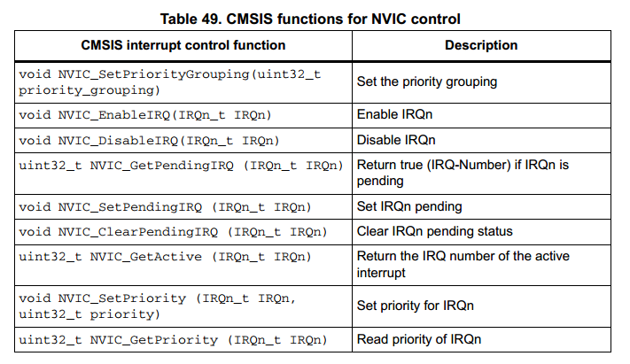
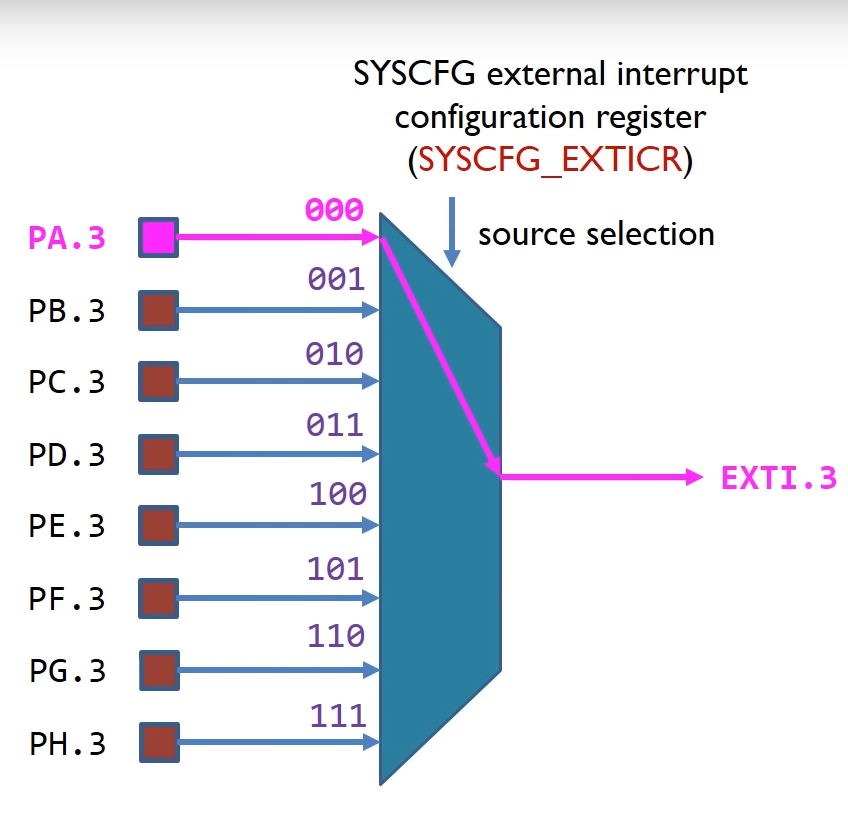
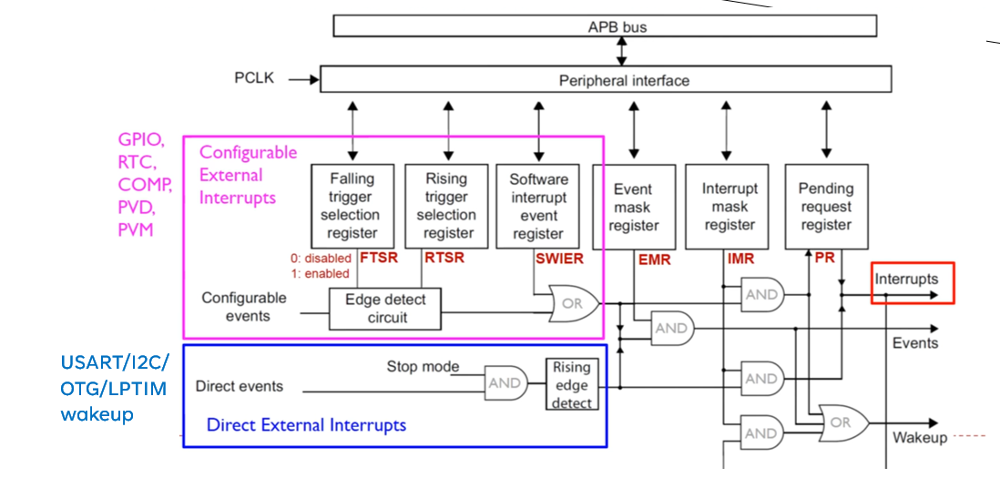
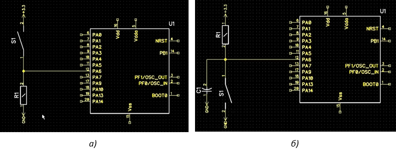
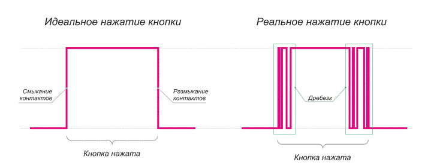
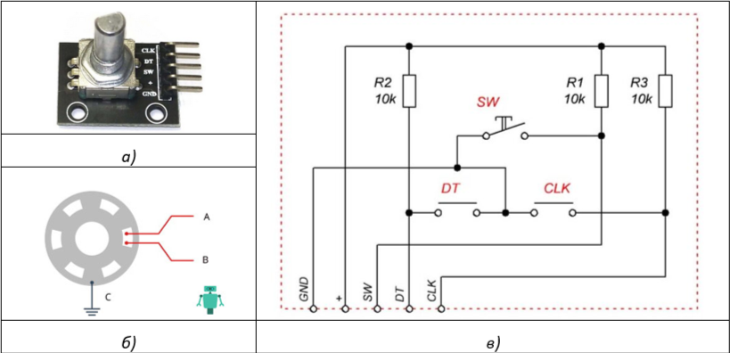
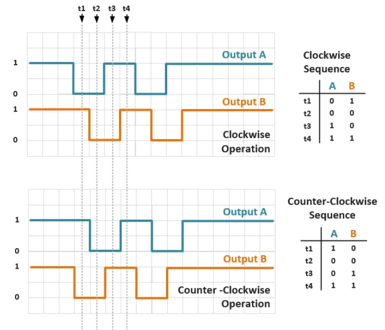
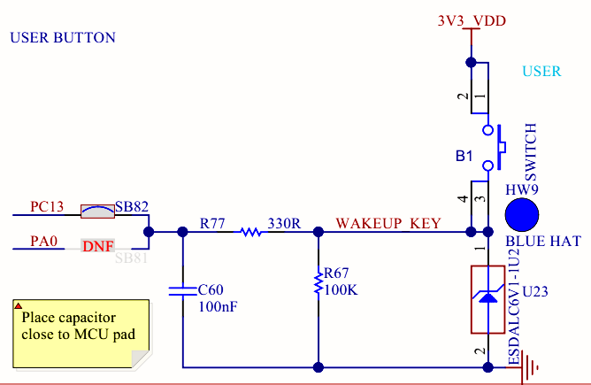

# Лабораторная работа № 5. Контроллер внешних прерываний. Кнопки. Инкрементный поворотный энкодер.

[#Цели работы](#цели-работы)\
[#Контроллер прерываний NVIС](#контроллер-прерываний-nvic)\
[#Контроллер внешних прерываний EXTI](#контроллер-внешних-прерываний-exti)\
[Кнопка](#кнопка)\
[- Инкрементный поворотный энкодер](#инкрементный-поворотный-энкодер)\
[- Этап 1. Программа обработки нажатия кнопки по прерыванию.](#этап-1-программа-обработки-нажатия-кнопки-по-прерыванию)\
[- Задание. Программа обработки энкодера в режиме прерываний.](#задание-программа-обработки-энкодера-в-режиме-прерываний)

## Цели работы

Целью настоящей работы является получение практических навыков программирования обработки внешних прерываний от коммутационных устройств.

## Контроллер прерываний NVIС

Контроллер прерываний NVIC встроен в ядро микроконтроллера STM32 и предназначен для управления обработкой внутренних программных исключений и внешних (по отношению к ядру) исключений, называемых прерываниями.

Каждому исключению соответствует:

-	номер исключения;
-	функция обработки прерываний (ISR), адрес который находится в векторе прерываний;
-	бит разрешения перекрывания  (enable bit);
-	бит ожидания обработки (pending bit);
-	бит активного перекрывания (active bit);
-	приоритет прерывания.

Для управления контроллером NVIC в библиотеке CMSIS имеются следующие функции. 

<p align="center" > </p>

NVIC микроконтроллера STM32H745 поддерживает до 16 уровней приоритета. Это число может быть разделено на вытесняемые (групповые) приоритеты и субприоритеты (в группе). Группировка по умолчанию соответствует 16 вытесняемым приоритетам (субприоритеты отсутствуют). 

## Контроллер внешних прерываний EXTI

Контроллер внешних прерываний EXTI отвечает за обработку внешних по отношению к микроконтроллеру прерываний. В частности, контроллер EXTI позволяет генерировать сигнал активации прерывания в контроллер NVIC при изменении уровня сигнала на линии ввода-вывода микроконтроллера. 

Линии ввода-вывода микроконтроллера обозначаются PXY, где X – имя порта (A, B, … K), а X – номер пина порта. Номер пина соответствует входной линии EXTI. Например, к третьей линии EXTI может быть подключен один из входов PA3, PB3 … PH3.

<p align="center" > </p>

<p align="center" >Рисунок 1.1 – Установка соответствия порта ввода-вывода линии EXTI</p>  

Сигналы портов ввода-вывода могут быть подключены к первым шестнадцати линиям EXTI контроллера с помощью регистров SYSCFG_EXTICRх. Четыре регистра SYSCFG_EXTICRх содержат 16 четырехбитных полей – по одному на каждую входную линию EXTI (по четыре поля в каждой регистре). Значение поля определяет порт (A, B … K), который является источником для соответствующей линии. Логическая блок-схема EXTI представлена на рис 1.2.

<p align="center" > </p>

<p align="center" >Рисунок 1.2 – Логическая схема контроллера EXTI</p> 

Для управления порываниями в EXTI предусмотрены следующие регистры:  

- FTSR – включение/отключение обработки по нарастающему фронту сигнала;
- RTSR – включение/отключение обработки по ниспадающему фронту сигнала;
- SWIER – программная генерация прерывания;
- EMR – разрешение исключения;
- IMR – разрешение прерывания;
- PR – регистр ожидания обработки внешнего прерывания.

В зависимости от включения битов в регистрах и при соответствующем входном сигнале, EXTI генерирует прерывание EXTI0_IRQ, EXTI1_IRQ, … EXTI4_IRQ, EXTI9_5_IRQ, EXTI15_10IRQ.

Для конфигурации прерывания порта ввода-вывода необходимо выполнить следующие действия:

1. Проанализировать входную схему. Определить порт и пин цифрового входа. Сконфигурировать пин ввода-вывода в режим ввода. При необходимости включить подтягивающий резистор.
2. Включить тактирование банка регистров SYSCFG_EXTICRx.
3. Установить соответствие порта цифрового входа линии EXTI. Номер пина соответствует номеру линии EXTI.
4. Сконфигурировать линию перекрывания EXTI: задать триггеры для срабатывания прерывания (регистры FTSR, RTSR) и демаскировать прерывание (регистр IMR).
5. Включить генерацию сигнала перекрывания.
6. Сбросить бит ожидания обработки прерывания.
7. Разрешить прерывание соответствующей линии EXTI в контроллере NVIC.

Обработчик прерывания линии EXTI должен выполнить следующие шаги:

- Проверить источник прерывания в регистре PR. 
- Сбросить флаг ожидания обработки в регистре PR, путем записи 1 в соответствующий бит.
- Выполнить операции для реализации задуманной логики обработки перекрывания.

## Кнопка 
Обычная кнопка представляет собой замыкающий контакт. Типовые схемы подключения кнопки к цифровому входу микроконтроллера показаны на рисунке.

<p align="center" > </p>

<p align="center" >Рисунок 1.3 – Типовые схемы подключения кнопки к цифровому входу микроконтроллера.</p> 

При анализе схемы следует обратить внимание на уровень сигнала, соответствующий «нажатому» состоянию кнопки  ( а – логическая единица, б – логический ноль). 

Также следует отметить наличие подтягивающего резистора (на рисунке – R1), который обеспечивает стабильное состояние сигнала в момент, когда кнопка не нажата. Если такой резистор в схеме отсутствует, то его можно включить для цифрового входа с помощью регистра GPIO_PUPDx.

Наконец, следует обратить внимание на наличие схемы защиту от «дребезга» контакта (конденсатор С1 на рисунке). Явление дребезга возникает в момент коммутации контакта (рис. 1.4). В результате дребезга сигнал однократного включения может быть ошибочно обработан, как многократное включение и выключение.  

<p align="center" > </p>

<p align="center" >Рисунок 1.4 – Явление дребезга контактов.</p> 

При отсутствии схемотехнического решения  защита от дребезга может быть реализована в программе, например, следующими способами:

- путём временной задержки чтения сигнала, на период вероятного дребезга контактов;
- методом многократного считывания сигнала, на заданном временном интервале (обычно, в пределах от 10 до 100 мкс); цепь считается замкнутой (разомкнутой), если в этом временном интервале фиксируется устойчивое состояние;

## Инкрементный поворотный энкодер

Поворотный энкодер – это механическое устройство, предназначенное  для фиксации поворота ручки в том или ином направлении на определенное количество шагов. 

<p align="center" > </p>

<p align="center" >Рисунок 1.5 – Поворотный энкодер с кнопкой KY-040 а) внешний вид; б) механическая модель;  в) электрическая схема. 
</p> 

В настоящей работе используется инкрементный поворотный энкодер KY-040, который имеет 20 шагов. Дополнительно, ручка энкодера может выполнять функцию кнопки.

При повороте на один шаг выводы A и B  (или «DT» «СLCK» на схеме) размыкаются и снова замыкаются. Механически это реализовано таким образом, что замыкание/размыкание выводов происходит не одновременно, а с временным смещением. Получаемый логический сигнал (без учета дребезга контактов) при повороте направо и повороте налево показан на рисунке 1.6.

<p align="center" > </p>

<p align="center" >Рисунок 1.6 – Выходной сигнал поворотного энкодера.</p> 

Задача обработки энкодера сводится к детектированию поворота на один шаг и определении направления поворота. 

Простейший способ обработки энкодера заключается в отслеживании изменения фронта сигнала A и определение направления поворота по сигналу B.  Можно заметить, что при повороте по часовой стрелке, после изменения фронта сигнала А,  сигнал B имеет обратное логическое значение. А при повороте против часовой стрелки – то же логическое значение. 

### Этап 1. Программа обработки нажатия кнопки по прерыванию.

Демонстрационная программа переключает светодиоды по нажатию голубой кнопки на отладочной плате. 

1. Ознакомьтесь со схемой подключения кнопки (рис. 1.7) и убедитесь, что:

- кнопка подключена к вводу PC13; 
- по нажатию формируется логическая единица, а при отпускании – ноль; 
- подтягивающий резистор не требуется. 
- подтягивающий резистор не требуется. 

<p align="center" > </p>

<p align="center" >Рисунок 1.7 – Схема подключения кнопки в отладочной плате Nucleo-STH745ZI-Q.</p> 

1. Создайте проект для платформы *ststm32*, платы *nucleo_h745zi_q*, фреймворка *CMSIS* и процессора CORTEX-M7.  За основу возьмите проект из предыдущей лабораторной работы, в котором имеютcя созданные ранее библиотеки *vterm* и *led*.

2. Добавьте (замените) в проект файл main.c и поместите в него демонстрационной программы (листинг 1.1).  

3. Ознакомьтесь с текстом программы, и обратите внимание на алгоритм конфигурации обработки прерывания.

*Листинг 1.1 – main.c*

``` C++
#include <stm32h7xx.h>
#include <stm32h745xx.h>
#include <led.h>

void blue_button_init() {
    // 1) Сконфигурировать пин ввода-вывода в режим входа. 
    SET_BIT(RCC->AHB4ENR, RCC_AHB4ENR_GPIOCEN);
    MODIFY_REG(GPIOC->MODER, GPIO_MODER_MODE13, 0);
    // 2) Включить тактирование банка регистров SYSCFG_EXTICRx
    RCC->APB4ENR |= RCC_APB4ENR_SYSCFGEN;
    // 3) Установить соответствие порта цифрового входа линии EXTI
    MODIFY_REG(SYSCFG->EXTICR[3], SYSCFG_EXTICR4_EXTI13_Msk, SYSCFG_EXTICR4_EXTI13_PC);
    // 5) задать триггеры для срабатывания прерывания  
    EXTI->RTSR1 |= EXTI_RTSR1_TR13; // по нарастающему фронту
    EXTI->FTSR1 |= EXTI_RTSR1_TR13; // по ниспадающему фронту
    // 4) Включить генерацию сигнала прерывания 
    EXTI->IMR1 |= EXTI_IMR1_IM13; // разрешаем сигнал активации прерывания
    // 6) Сбросить бит ожидания прерывания для указанной линии
    EXTI->PR1 = EXTI_PR1_PR13;  
}

int blue_button_pressed() {
    return GPIOC->IDR & GPIO_IDR_ID13;
}

void blue_button_edge_handler() {
    if (blue_button_pressed())
        led_green_toggle();
    else
        led_yellow_toggle();
}

int main() {
    led_yellow_enable();
    led_green_enable();
    led_green_toggle();
    blue_button_init();
    // 7) Разрешить прерывание соответствующей линии EXTI в контроллере NVIC
    NVIC_EnableIRQ(EXTI15_10_IRQn);
    while (1) {
        ; 
    }
    return 0;
}

/**************** IRQs *********************************************************/
void EXTI15_10_IRQHandler() {
    if (EXTI->PR1 & EXTI_PR1_PR13) { // a) проверить источник прерывания в регистре PR
        EXTI->PR1 = EXTI_PR1_PR13;  // б) сбросить флаг ожидания обработки в регистре PR
        blue_button_edge_handler(); // в) выполнить операции для реализации задуманной логики 
    }
}
```

4. Выполните сборку проекта, загрузите программу в память микроконтроллера и проверьте её работу.

### Задание. Программа обработки энкодера в режиме прерываний.

1. Схема энкодера приведена на рисунке 1.5, в. Однако необходимо визуально контролировать и учитывать это при разработке программы  фактическое наличие резисторов R1, R2, R3 на печатной плате энкодера. Сигналы SW, DT и CLK  подключены напрямую к портам ввода вывода микроконтроллера:

<p align="right" >SW — PG12</p>
<p align="right" >DT —   PG14</p>
<p align="right" >CLK — PG8</p>

2. Доработать программу из листинга 1.1 c учетом следующих требований:

- [x] 1. Программа должна хранить переменную-счетчик, равный нулю в момент запуска.
- [x] 2. При повороте энкодера по часовой (против часовой) стрелке на N шагов программа должна:  увеличивать (уменьшать) значение счетчика на N и выводить его значение в терминал.
- [x] 3. При нажатии на кнопку энкодера программа должна сбросить значение счетчика в ноль и вывести его значение на экран.
- [x] 4. Предусмотреть программную защиту от дребезга контактов.
- [x] 5. Допускается использовать библиотеки LL и CMSIS.

> Для вывода в терминал использовать библиотеку vterm из предыдущей лабораторной работы. Для защиты от дребезга рекомендуется использовать библиотеку  systim из предыдущей лабораторной работы.


