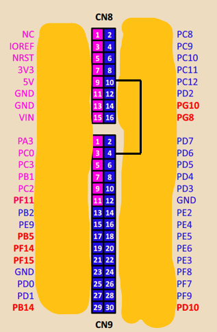
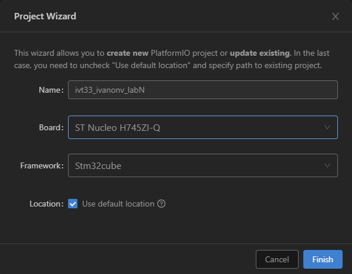

# Лабораторная работа № 6. Библиотека HAL. UART. Часть 1.

[#Цель работы](#цель-работы)\
[#Литература](#литература)\
[#Прием и передача данных по интерфейсу UART](#прием-и-передача-данных-по-интерфейсу-uart)\
[Режимы работы с модулем UART](#режимы-работы-с-модулем-uart)\
[- Порядок выполнения работы](#порядок-выполнения-работы)\
[- Этап 1. Создание решения PlatformIO с подключением библиотеки HAL](#этап-1-создание-решения-platformio-с-подключением-библиотеки-hal)\
[- Этап 2. Конфигурация библиотеки HAL](#этап-2-конфигурация-библиотеки-hal)\
[- Этап 3. Программа хоккугенератора](#этап-3-программа-хоккугенератора)\
[- Задание №1 Программа для ядра CORTEX-M7.](#задание-№1-программа-для-ядра-cortex-m7)\
[- Приложение. Файлы библиотеки vterm.](#приложение-файлы-библиотеки-vterm)

## Цель работы

Целью настоящей работы является получение практических навыков программирования обработки внешних прерываний от коммутационных устройств.

## Литература

В рамках подготовки к работе следует ознакомиться с разделами 5 и 90 руководства UM2217 «Description of STM32H7 HAL and low-layer drivers», а также с разделами 51 и 16 RM0399.

## Прием и передача данных по интерфейсу UART

В настоящей работе мы создадим программы условных устройств, передающих и принимающих данные по интерфейсу UART. Такая схема взаимодействия широко распространена во встраиваемых системах, например, в задаче приёма данных от навигационного источника в формате NMEA протокола.

1. Хоккугенератор (генератор)

Первым условным устройством будет «Хоккугенератор». Программа хоккугенератора выполняется на ядре CORTEX-M4 микроконтроллера STM32H745ZI-Q и непрерывно передает в последовательный асинхронный интерфейс UART5 трёхстрочные хокку в символьном режиме в кодировке UTF-8. 

Формат выдачи одного хокку следующий:

#{Номер хокку XX}{Строка 1}|{Строка 2}|{Строка 3}

Например: 

#06|Тишина кругом.|Проникают в сердце скал|Голоса цикад.

Выдача хокку выполняется на фиксированной скорости 9600 бод/с, без проверки четности.

2. Хоккуанализатор (анализатор)

Второе устройство, «Хоккуанализатор», принимает и обрабатывает данные хоккугенератора. Программа хоккуанализатора выполняется на ядре CORTEX-M7 и принимает хокку по интерфейсу UART2 в определенном выше формате. Базовая обработка заключается в выводе хокку на терминал компьютера через COM-порт ST-Link на скорости 57600 бод/с.

3. Связь и разделение ресурсов между программами

Для сопряжения устройств по интерфейсу UART нам понадобится всего одна линия (перемычка), соединяющая UART5-TX (порт PC12) и UART2-RX (порт PD6). Схема соединения показана на рис. 1.1.

Вывод данных в терминал будем выполнять на скорости 57600 бод/с в блокирующем режиме с помощью библиотеки «vterm», которая уже встречалась в предыдущих работах. 

<p align="center" > </p>

<p align="center" >Рисунок 1.1 – Соединение UART5-TX (порт PC12) и UART2-RX (порт PD6) в отладочной плате ST Nucleo-H745ZI-Q</p> 

Ресурсы, принадлежащие хоккугенератору:

- ядро CORTEX-M4;
- красный светодиод для индикации ошибки;
- зеленый светодиод для индикации работы;
- UART5-TX (порт PC12);
- DMA2.

Ресурсы, принадлежащие хоккуанализатору:

- ядро CORTEX-M7;
- порт UART3 (вывод ST-Link) для вывода хокку, ошибок и взаимодействия с пользователем через терминал;
- желтый светодиод для индикации;
- UART2-RX (порт PD6) и прочие ресурсы.

### Режимы работы с модулем UART

Микроконтроллер STM32 и библиотека HAL предоставляют три способа обмена данными между узлами по интерфейсу UART: режим опроса, режим прерываний и DMA. Описание работы с драйвером UART библиотеки HAL приведено в разделе 90.2 руководства UM2217.

В режиме опроса (polling mode), также называемом блокирующим режимом (blocking mode), приложение блокируется в ожидании завершения передачи или приема данных.

В режиме прерываний (interrupt mode), также называемом неблокирующим режимом (non-blocking mode) процедуры приёма и передачи данных завершаются сразу после конфигурации периферийного устройства. Завершение приёма или передачи отслеживается библиотекой HAL в обработчике прерываний и сигнализируется приложению через функцию обратного вызова.

Режим DMA является неблокирующим, но при этом обеспечивает наилучшую пропускную способность передачи благодаря прямому доступу периферийного устройства UART к внутренней памяти микроконтроллера.

## Порядок выполнения работы

### Этап 1. Создание решения PlatformIO с подключением библиотеки HAL

Используя механизм окружений PlatformIO создадим решение (Solution) с двумя проектами. 

1. Отройте VSCode. Откройте домашнюю страницу PlatformIO. Нажмите кнопку «New project». Введите в форму имя проекта, используемую плату и фреймворк «Stm32Cube».

<p align="center" > </p>

<p align="center" >Рисунок 1.2 – Окно «Project Wizard»</p> 

2. Создайте в корневой директории проекта папку cm4 (для хоккугенератора) и папку cm7 (для хоккуанализатора). Названия папок отражают название проекта и ядро, на котором выполняется программа.

3. Отредактируйте файл platformio.ini создав два окружения 

*Листинг 1 – platformio.ini*

``` C++
[platformio]
default_envs = cm7 

[env]
platform = ststm32
board = nucleo_h745zi_q
framework = stm32cube
build_type = debug
monitor_speed = 57600
board_build.stm32cube.disable_embedded_libs = yes
board_build.stm32cube.custom_config_header = yes
lib_deps = bspH745

[env:cm7]
build_flags = -DCORE_CM7 -std=c11 -Wall -Wextra
build_src_filter =  +<$PROJECT_DIR/cm7/*.c> 
board_build.ldscript = STM32H745ZITX_M7_FLASH.ld

[env:cm4]
build_flags = -DCORE_CM4 -std=c11 -Wall -Wextra
build_src_filter =  +<$PROJECT_DIR/cm4/*.c> 
board_build.ldscript = STM32H745ZITX_M4_FLASH.ld
```

В строке 7 указан параметр framework = stm32cube, поэтому PlatformIO автоматически добавит в сборку проекта библиотеку HAL, как составную частью фреймворка Stm32Cube. Также PlatformIO включает в сборку программы startup-файл и system-файл «по умолчанию», взяв их из шаблонов фреймворка Stm32Cube. Содержимое этих файлов было рассмотрено в предыдущих работах.

С помощью параметра board_build.ldscript для каждого проекта указывается скрипт компоновщика.

С помощью параметры build_src_filter мы устанавливаем путь к исходным файлам для каждого проекта. При этом директории include и src остаются общими – файлы в этих папках включаются сборку обоих проектов.

4. Добавьте в папку lib/bspH745 проекта библиотеку led для управления светодиодами и vterm для работы с терминалом компьютера. Библиотека led была разработана на первой лабораторной работе. Актуальный код библиотеки vterm находится в приложении.

### Этап 2. Конфигурация библиотеки HAL

Согласно руководству UM2217 в проект должен быть включен и отредактирован файл конфигурации stm32h7xx_hal_conf.h, созданный из шаблона stm32h7xx_hal_conf_template.h. 

PlatformIO автоматически включает в сборку копию этого шаблона, однако при этом нет возможности внести в него изменения и выполнить конфигурацию библиотеки HAL. Чтобы изменить это поведение в файл platformio.ini добавлен параметр board_build.stm32cube.custom_config_header = yes.

1. Скопируйте файл stm32h7xx_hal_conf_template.h, расположенный в c:\PlatformIO\packages\framework-stm32cubeh7\Drivers\STM32H7xx_HAL_Driver\Inc\ в папку include в директории проекта и переименуйте его в stm32h7xx_hal_conf.h

2. Откройте файл stm32h7xx_hal_conf.h и закомментируйте в секции «Module Section» все модули, кроме HAL_MODULE_ENABLED и тех, которые могут понадобиться при решении поставленной задачи, а именно:

<p align="center" >#define HAL_MODULE_ENABLED</p>
<p align="center" >#define HAL_CORTEX_MODULE_ENABLED</p>
<p align="center" >#define HAL_DMA_MODULE_ENABLED</p>
<p align="center" >#define HAL_EXTI_MODULE_ENABLED</p>
<p align="center" >#define HAL_GPIO_MODULE_ENABLED</p>
<p align="center" >#define HAL_RCC_MODULE_ENABLED</p>
<p align="center" >#define HAL_UART_MODULE_ENABLED</p>
<p align="center" >#define HAL_USART_MODULE_ENABLED</p>

Отключение лишних модулей позволит сократить время сборки библиотеки и получать более релевантные подсказки при редактировании кода.

3. Добавьте в папку include вспомогательный файл hal_helpers.h с функциями, преобразующими коды состояний коды выполнения функций библиотеки HAL в строковый тип. Эти функции можно использовать для вывода в терминал при отладке программы.

*Листинг 2 – include/hal_helpers.h*

``` C++
#pragma once
#include "stm32h7xx_hal.h"

#define CASE(VAL) case VAL: return #VAL

static inline const char *hal_status_to_string(HAL_StatusTypeDef status) {
  switch (status) {
    CASE(HAL_OK);
    CASE(HAL_TIMEOUT);
    CASE(HAL_BUSY);
    CASE(HAL_ERROR);
  default:
    return "UNKNOWN";
  }
}

static inline const char *hal_uart_state_to_string(HAL_UART_StateTypeDef state) {
  switch (state) {
    CASE(HAL_UART_STATE_RESET);
    CASE(HAL_UART_STATE_READY);
    CASE(HAL_UART_STATE_BUSY);
    CASE(HAL_UART_STATE_BUSY_TX);
    CASE(HAL_UART_STATE_BUSY_RX);
    CASE(HAL_UART_STATE_BUSY_TX_RX);
    CASE(HAL_UART_STATE_TIMEOUT);
    CASE(HAL_UART_STATE_ERROR);
  default:
    return "UNKNOWN";
  };
};

static inline const char *hal_uart_error_to_string(uint32_t error) {
  switch (error) {
    CASE(HAL_UART_ERROR_NONE);
    CASE(HAL_UART_ERROR_PE);
    CASE(HAL_UART_ERROR_NE);
    CASE(HAL_UART_ERROR_FE);
    CASE(HAL_UART_ERROR_ORE);
    CASE(HAL_UART_ERROR_DMA);
    CASE(HAL_UART_ERROR_RTO);
  default:
    return "UNKNOWN";
  }
}

#undef CASE
```

### Этап 3. Программа хоккугенератора

- [x] 1. Создайте в проекте папку cm4 и поместите в неё файл cm4_main.h, содержащий общие заголовочные файлы и определения.

*Листинг 3 – cm4/cm4_main.h*

``` C++
#pragma once
#include "stm32h7xx_hal.h"
#include <led.h>
extern UART_HandleTypeDef huart;
```

- [x] 2. Создайте в папке cm4 файл cm4_main.c и вставьте в него код из листинга 4.

*Листинг 4 – cm4/cm4_main.c*

``` C++
#include "cm4_main.h"

const char hokkus[] = u8"#01|Старый пруд.|Прыгнула в воду лягушка.|Всплеск в тишине."
"#02|Хорошо по воде брести|Через тихий летний ручей|C сандалиями в руке."
"#03|О, с какой тоской|Птица из клетки глядит|На полет мотылька!"
"#04|Вода так холодна!|Уснуть не может чайка,|Качаясь на волне."
"#05|Сочла кукушка|Мгновения летних дней|И улетела."
"#06|Тишина кругом.|Проникают в сердце скал|Голоса цикад."
"#07|Убил паука,|И так одиноко стало|В холоде ночи."
"#08|Чужих меж нами нет!|Мы все друг другу братья|Под вишнями в цвету."
"#09|Отсечь слова.|Ненужное отбросить.|Радостно вздохнуть."
"#10|На полпути.|Не остановится|Цветков паденье!"
"#11|Снег все сыплет|И сыплет,|Если на него смотреть."
"#12|Зимняя ночь.|Закипает уха|Из озерной рыбы."
"#13|Лист сакуры...|Такой же формы вырезаю|Из листка бумаги.";

UART_HandleTypeDef huart;

void error_handler() {
  led_red_enable();
  led_red_toggle();
  while (1) {
    for (volatile unsigned i = 0; i < 800000; i++);
    led_red_toggle();
  }
}

void uart_init() {
  huart.Instance = UART5;
  huart.Init.BaudRate = 9600;
  huart.Init.WordLength = UART_WORDLENGTH_8B;
  huart.Init.StopBits = UART_STOPBITS_1;
  huart.Init.Parity = UART_PARITY_NONE;
  huart.Init.HwFlowCtl = UART_HWCONTROL_NONE;
  huart.Init.Mode = UART_MODE_TX;
  huart.Init.OverSampling = UART_OVERSAMPLING_16;
  if (HAL_UART_Init(&huart) != HAL_OK) { // calls HAL_UART_MspInit()
    error_handler();
  }
}

int main() {
  HAL_Init(); // calls HAL_MspInit()
  uart_init();
  if (HAL_UART_Transmit_DMA(&huart, hokkus, sizeof(hokkus)-1) != HAL_OK) {
      error_handler();
  }
  while (1) {
    ;
  }
}

void HAL_UART_TxCpltCallback(UART_HandleTypeDef *huart) {
  (void*)(huart);
  led_green_toggle();
}

void HAL_UART_ErrorCallback(UART_HandleTypeDef *huart) {
  (void*)(huart);
  error_handler();
}
```

- [x] 3. Изучите код и алгоритм работы программы.
- [x] 3.1. В глобальной области видимости определен массив хокку hokkus и дескриптор huart типа UART_HandleTypeDef. Дескриптор представляет собой структуру для управления устройством UART, которая содержит его состояние и конфигурацию.
- [x] 3.2. Для инициализации UART в коде определена функция uart_init(). Конфигурация устройства UART осуществляется через структуру Init дескриптора huart. Для этого полям структуры Init присваиваются необходимые значения. Затем дескриптор передается в функцию HAL_USART_Init(), которая, в свою очередь, взывает коллбек-функцию HAL_USART_MspInit().
- [x] 3.3. Для успешной инициализации UART необходимо переопределить эту функцию, выполнив настройку тактирования, портов ввода-вывода и других необходимых ресурсов.
- [x] 3.4. Функция main()начинается c вызова функции HAL_Init(). Функция HAL_Init() должна быть вызвана раньше любой другой функции библиотеки HAL и предназначена для инициализации библиотеки HAL, а именно: конфигурацию таймера *SysTick* и политику группировки приоритетов контроллера прерываний (16 вытесняемых приоритетов). В завершении в функции HAL_Init() вызывается коллбек-функция HAL_MspInit(), которая может быть переопределена разработчиком для реализации глобальных процедур инициализации микроконтроллера. 
- [x] 3.5. Следующим после инициализации библиотеки HAL шагом является вызов функции инициализации устройства UART5 uart_init().
- [x] 3.6. Затем вызывается функции HAL_UART_Transmit_DMA() для передачи массива с хокку в UART в режиме DMA. DMA будет настроен в циклическом режиме. Таким образом, после завершения передачи массива данных, DMA контроллер автоматически перегрузит собственные счетчики размера данных, адреса источников и назначения и начнет новый цикл передачи.
- [x] 3.7. Возов HAL_UART_Transmit_DMA() является неблокирующим. Передача данных выполняется в фоновом режиме. Поэтому функция main() завершается пустым циклом.
- [x] 3.8. Возникновение ошибок передачи и факт завершения цикла передачи отслеживаются с помощью специально предусмотренных коллбек-функций: HAL_UART_ErrorCallback() и HAL_UART_TxCpltCallback(). Эти функции переопределены для сигнализации светодиодами. При возникновении ошибки программа войдет в бесконечный цикл мигания красным светодиодом. В рабочем режиме программа будет мигать зеленым светодиодом, переключая его после каждого цикла завершения передачи.
- [x] 4. Приложение HAL должно содержать *msp*-файл с определением функций обратного вызова для низкоуровневой инициализации ресурсов. Создайте файл cm4_msp.с используя листинг 5. 

*Листинг 5 – cm4/cm4_msp.c*

``` C++
#include "cm4_main.h"

/*
  USART2 (Receiver): PD6 (AF7) -> USART2_TX;  PD5 (AF7) -> USART2_RX;
  USART3 (St-Link): PD8 (AF7) -> USART3_TX;  PD9 (AF7) -> USART3_RX;
  USART5 (Sender): PD2 (AF8) -> USART5_RX;  PC12 (AF8) -> USART5_TX;
*/
void HAL_MspInit(void) {
  led_red_enable();
  led_green_enable();
}

void HAL_UART_MspInit(UART_HandleTypeDef *huart) {
  if (huart->Instance == UART5) {
    // Clock config
    __HAL_RCC_UART5_CLK_ENABLE();
    __HAL_RCC_GPIOD_CLK_ENABLE();
    __HAL_RCC_GPIOC_CLK_ENABLE();
    __HAL_RCC_DMA2_CLK_ENABLE();
    __HAL_RCC_USART234578_CONFIG(RCC_USART234578CLKSOURCE_HSI);  // Kernel clock source

    // TX pins config
    GPIO_InitTypeDef gpio_init = {.Pin = GPIO_PIN_12,
                                  .Mode = GPIO_MODE_AF_PP,
                                  .Pull = GPIO_PULLDOWN,
                                  .Speed = GPIO_SPEED_FREQ_LOW,
                                  .Alternate = GPIO_AF8_UART5};
    HAL_GPIO_Init(GPIOC, &gpio_init);

    // DMA for sending (TX)
    static DMA_HandleTypeDef hdma_tx = {0};
    hdma_tx.Instance = DMA2_Stream0;
    hdma_tx.Init.Request = DMA_REQUEST_UART5_TX;
    hdma_tx.Init.Direction = DMA_MEMORY_TO_PERIPH;
    hdma_tx.Init.PeriphInc = DMA_PINC_DISABLE;
    hdma_tx.Init.MemInc = DMA_MINC_ENABLE;
    hdma_tx.Init.PeriphDataAlignment = DMA_PDATAALIGN_BYTE;
    hdma_tx.Init.MemDataAlignment = DMA_MDATAALIGN_BYTE;
    hdma_tx.Init.Mode = DMA_CIRCULAR;
    hdma_tx.Init.Priority = DMA_PRIORITY_LOW;
    hdma_tx.Init.FIFOMode = DMA_FIFOMODE_DISABLE;

    if (HAL_DMA_Init(&hdma_tx) != HAL_OK) {
      error_handler();
    }

    __HAL_LINKDMA(huart, hdmatx, hdma_tx);

    HAL_NVIC_SetPriority(DMA2_Stream0_IRQn, 1, 0);
    HAL_NVIC_EnableIRQ(DMA2_Stream0_IRQn);
    HAL_NVIC_SetPriority(UART5_IRQn, 1, 0);
    HAL_NVIC_EnableIRQ(UART5_IRQn);
  }
}
```

- [x] 5. Изучите кода листинга 5.
- [x] 5.1. В функции HAL_MspInit() выполняется инициализация используемых светодиодов.
- [x] 5.2. В функции HAL_UART_MspInit() выполняется низкоуровневая инициализация UART5 для работы в режиме DMA:
  - для включения тактирования устройств в библиотеке HAL предусмотрены макросы формата __HAL_RCC_PPP_CLK_ENABLE(), где PPP – название устройства;
  - используемые UART5 пины должны быть переведены режим альтернативной функции с соответствующим номером. Номера альтернативных функций для портов ввода-вывода приведены в таблицах 9 – 19 Datasheet микроконтроллера;
  - при использовании DMA необходимо создать и инициализировать дескриптор канала (потока) DMA и связать его с дескриптором UART с помощью специального макроса __HAL_LINKDMA();
  - при работе с UART режиме DMA задаются приоритеты и разрешаются прерывания соответствующего потока DMA и прерывания приёмопередатчика UART. 
- [x] 6. Согласно UM2217 обработчики прерываний должны быть определены в отдельном файле. Создайте файл cm4_it.c и поместите в него следующий код. 

*Листинг 6 – cm4/cm4_it.c*

``` C++
#include "cm4_main.h"

void SysTick_Handler(void) { 
  HAL_IncTick(); 
}

void DMA2_Stream0_IRQHandler(void) {
  HAL_DMA_IRQHandler(huart.hdmatx);
}

void USART5_IRQHandler(void) {
  HAL_UART_IRQHandler(&huart);
}
```

- [x] 7. Изучите кода листинга 6.
- [x] 7.1. В обработчике прерываний системного таймера SysTick_Handler() выполняется вызов функции HAL_IncTick(). Настройка системного таймера для генерации прерываний с периодом 1 мс выполняется в функции HAL_Init(). Вызов функции HAL_IncTick() необходим для работы функции HAL_Delay() и многих других функций библиотеки HAL, использующих таймер.
- [x] 7.2. Все остальные обработчики прерываний в HAL-приложении должны вызывать соответствующие функции-обработчики драйвера библиотеки HAL, которые имеют название HAL_PPP_IRQHandler(), где PPP – имя соответствующего устройства (драйвера).
- [x] 8. В редакторе VSCode выберите окружение сборки cm4, выполните сборку проекта и загрузите программу в микроконтроллер.

> После загрузи проекта программа хоккугенератора не начнет свою работу, так как ядро 
CORTEX-M4 находится в режиме ожидания (gated) после сброса микроконтроллера.

### Задание №1 Программа для ядра CORTEX-M7.

1. В папке проекта создайте папку cm7. В папке cm7 создайте пустые файлы cm7_main.c, cm7_main.h, cm7_it.c, cm7_msp.c.

2. Напишите код в файл cm7_main.h

*Листинг 7 – cm7/cm7_main.h*

``` C++
#pragma once
#include "stm32h7xx_hal.h"
#include <led.h>
#include <vterm.h>

extern UART_HandleTypeDef uart;

void on_error();
```

3. Напишите код в файл cm7_main.c

*Листинг 9 – cm7/cm7_main.с*

``` C++
#include "cm7_main.h"
#include <stdio.h>

void assert_failed(uint8_t *file, uint32_t line) {
  printf("\r\nHAL wrong parameter value at %s:%lu\r\n", file, line);
  on_error();
}

void on_error() {
  led_yellow_enable();
  while (1) {
    for (volatile int i = 0; i < 8000000; i++)
      ;
  }
}

int main() {
  HAL_Init();
  HAL_RCCEx_EnableBootCore(RCC_BOOT_C2); // Запуск ядра CM4
  while (1) {
  }
}
```

4. Напишите код в файл cm7_it.c

*Листинг 8 – cm7/cm7_it.c*

``` C++
#include "cm7_main.h"

void SysTick_Handler() { 
  HAL_IncTick();
}
```

5. В редакторе VSCode выберите окружение сборки cm7, выполните сборку проекта и загрузите программу в микроконтроллер.

6. Проанализируйте код программы и объясните результат работы программ. 

7. Как будет работать отладочная плата если вместо параметра RCC_BOOT_C2 в строке 19 файла сm7_main.c передать в функцию число 93?

### Приложение. Файлы библиотеки vterm.

*Листинг 1 – vterm.h*

``` C++
/**
 * @file vterm.h
 * @author SB.Simonov
 * @brief vterm library for Nucleo STM32H75ZI-Q
 * @version 0.2
 * @copyright Copyright (c) 2024
 */

#pragma once
#include <stdbool.h>

void vterm_init(int baudrate);

/**** FOR WRITING *****/

// use stdio: putchar()

// use stdio: puts()

// use stdio: printf()

void vterm_write(char *ptr, int len);

/**** FOR READING ****/

// use stdio: getchar()

// use stdio: getc()

// use stdio: gets()

int vterm_gets(char* buf, int len, bool echo);
```

*Листинг 2 – vterm.c*

``` C++
#include "vterm.h"
#include "stm32h745xx.h"
#include "stm32h7xx.h"
#include <assert.h>
#include <stdio.h>

#ifndef HSI_VALUE
#define HSI_VALUE 64000000U
#endif
#define BLOCK(COND) do{}while(COND)

// ======================= Private functions =============================

static int lib_init_flag = 0;

/**
 * @brief Инициализации UART3: PD8(AF7)->USART3_TX, PD9(AF7)->USART3_RX; kernel сlock = HSI
 * @param baudrate скорость работы
 */
static void uart_init(int baudrate) {
  // Назначаем USART3 ядру CM7 и включаем тактирование
  SET_BIT(RCC_C1->APB1LENR, RCC_APB1LENR_USART3EN);
  // Выбираем HSI для Kernel clock
  MODIFY_REG(RCC->D2CCIP2R, RCC_D2CCIP2R_USART28SEL_0,
             RCC_D2CCIP2R_USART28SEL_0 | RCC_D2CCIP2R_USART28SEL_1);
  // Включаем тактирование GPIOD
  SET_BIT(RCC_C1->AHB4ENR, RCC_AHB4ENR_GPIODEN_Msk);
  // Режим альт. функции для PD8 и PD9
  MODIFY_REG(GPIOD->MODER, GPIO_MODER_MODE8_Msk | GPIO_MODER_MODE9_Msk,
             GPIO_MODER_MODE8_1 | GPIO_MODER_MODE9_1);
  // Назначем номер альт. функции PD8 и PD9, соотв. USART3
  MODIFY_REG(GPIOD->AFR[1], GPIO_AFRH_AFSEL8 | GPIO_AFRH_AFSEL9,
             GPIO_AFRH_AFSEL8_0 | GPIO_AFRH_AFSEL8_1 | GPIO_AFRH_AFSEL8_2 | GPIO_AFRH_AFSEL9_0 |
                 GPIO_AFRH_AFSEL9_1 | GPIO_AFRH_AFSEL9_2);
  // Режим "PushPull" для TX
  CLEAR_BIT(GPIOD->OTYPER, GPIO_OTYPER_OT8_Msk);
  // Без подтягивающих резисторов pull-up/pull-down на TX и RX
  MODIFY_REG(GPIOD->PUPDR, GPIO_PUPDR_PUPD8_Msk | GPIO_PUPDR_PUPD9_Msk, 0);
  // "Medium speed" для порта TX
  MODIFY_REG(GPIOD->OSPEEDR, GPIO_OSPEEDR_OSPEED8_Msk, GPIO_OSPEEDR_OSPEED8_0);

  // Настройка UART: 8-bit data, no parity, 1 stop bit, oversampling; enablingtx+rx
  MODIFY_REG(USART3->CR1, USART_CR1_TE | USART_CR1_RE, USART_CR1_TE | USART_CR1_RE);
  // Пределитель клока HSI/8 (8 МГц)
  MODIFY_REG(USART3->PRESC, USART_PRESC_PRESCALER, USART_PRESC_PRESCALER_2);
  // Конфигурация скорости приёмопередатчика
  USART3->BRR = HSI_VALUE / 8 / baudrate;
  // Отключаем детекцию и ошибки переполнения.
  USART3->CR3 |= USART_CR3_OVRDIS;
  // Включаем USART3
  USART3->CR1 |= USART_CR1_UE;

  BLOCK((USART3->ISR & USART_ISR_TEACK_Msk) == 0);
  BLOCK((USART3->ISR & USART_ISR_REACK_Msk) == 0);
}

/**
 * @brief Передача одного символа в UART3
 */
static inline void uart_putch(char ch) {
  // ожидание готовности сдвигового регистра
  BLOCK((USART3->ISR & USART_ISR_TXFE) != 0);
  USART3->TDR = ch;
}

static inline char uart_gech() {
  BLOCK((USART3->ISR & USART_ISR_RXNE_RXFNE) == 0);
  return (USART3->RDR) & 0xFF;
}

// ======================= Public functions =============================

/**
 *@brief Настройка семихостинга c UART3.
 */
void vterm_init(int baudrate) {
  uart_init(baudrate);
  setvbuf(stdin, NULL, _IONBF, 0);
  setvbuf(stdout, NULL, _IONBF, 0);
  setvbuf(stderr, NULL, _IONBF, 0);
  lib_init_flag = 1;
}

/**
 * @brief Передача пакета символов длинной len
 */
void vterm_write(char *ptr, int len) {
  assert(lib_init_flag);
  for (int i = 0; i < len; i++)
    uart_putch(ptr[i]);
  BLOCK((USART3->ISR & USART_ISR_TC) == 0);
}

/**
 * @brief Чтение строки из терминала в буфер
 * @note Чтение завершается при считывании символа перевода строки или возврата
 * каретки или при заполнении буфера. Данные дополняются символом конца строки.
 * @param buf - буфер
 * @param size - размер буфера
 * @return длина считаной строки
 */
int vterm_gets(char *buf, int size, bool echo) {
  assert(lib_init_flag);
  if (size == 0)
    return 0;
  int i = 0;
  while (i < size - 1) {
    char ch = uart_getch();
    if (echo)
      uart_putch(ch); // Echo to terminal
    if (ch == '\n' || ch == '\r') {
      break;
    }
    buf[i++] = ch;
  }
  buf[i] = '\0';
  return i;
}

// ======================= Newlib io functions =============================

int _write(int file, char *ptr, int len) {
  if ((file == 1 || file == 2) && lib_init_flag) {
    vterm_write(ptr, len);
    return len;
  }
  return 0;
}

int _read(int file, char *ptr, int len) {
  if (lib_init_flag && len > 0 || file == 0) {
    int i = 0;
    BLOCK((USART3->ISR & USART_ISR_RXNE_RXFNE) == 0);
    ptr[i++] = (USART3->RDR) & 0xFF;
    while (i < len) {
      int wait_timer = 1000;
      while ((USART3->ISR & USART_ISR_RXNE_RXFNE) == 0 && wait_timer-- > 0) {
      }
      if (wait_timer == 0)
        break;
      ptr[i++] = (USART3->RDR) & 0xFF;
    }
    return i;
  }
  return 0;
}
```