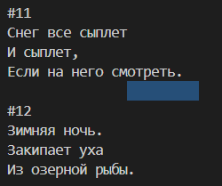

# Лабораторная работа № 7. Библиотека HAL. UART.Часть 2.

[#Цель работы](#цель-работы)\
[#Литература](#литература)\
[#Работа с UART в блокирующем режиме](#работа-с-uart-в-блокирующем-режиме)\
[Режимы работы с модулем UART](#режимы-работы-с-модулем-uart)\
[- Работа с UART в режиме прерываний](#работа-с-uart-в-режиме-прерываний)\
[- Работа с UART в режиме DMA](#работа-с-uart-в-режиме-dma)\
[- Задание №1 (обязательное).](#задание-№1-обязательное)\
[- Задание №2](#задание-№2)\
[- Задание №3 (дополнительное + 5 баллов к активности)](#Задание-№3-дополнительное-5-баллов-к-активности)

## Цель работы

Целью настоящей работы является получение практических навыков программирования двухъядерного микроконтроллера STM32 c помощью библиотеки HAL на примере работы с устройством UART в режимах опроса, прерываний и с помощью контроллера DMA.

## Литература

В рамках подготовки к работе следует ознакомиться с разделами 5 и 90 руководства UM2217 «Description of STM32H7 HAL and low-layer drivers», а также с разделами 51 и 16 RM0399.

## Работа с UART в блокирующем режиме

1. Для получения очередного байта данных из UART необходимо дождаться появления флага UART->RXNE и сохранить содержимое регистра UART->RDR в памяти приложения. Для передачи байта данных в UART необходимо дождаться установки флага UART->TXE и затем записать байт данный в регистр USART->TDR. При работе с драйвером библиотеки HAL прямой доступ к регистрам устройства из приложения не требуется. Ожидание флагов, запись и чтение из регистров выполняется в функциях HAL_UART_Receive() и HAL_UART_Transmit(), предназначенных для работы с UART в режиме опроса.

2. Для получения последовательности байт предназначена функция

HAL_StatusTypeDef HAL_UART_Receive(UART_HandleTypeDef *huart, uint8_t *pData, uint16_t Size, uint32_t Timeout);

где:

huart – указатель на экземпляр структуры-дескриптора типа UART_HandleTypeDef;

pData – указатель на массив размером не менее Size байт, в который будут помещены принятые данные. Функция блокирует выполнение программы до завершения приёма Size байт данных или до наступления таймаута. При успешном приеме всего массива данных функция вернет значение HAL_OK.

Timeout – время, выраженное в миллисекундах; если прием данных не завершается в течение заданного времени, функция прерывает свое выполнение и возвращает значение HAL_TIMEOUT. В библиотеке HAL существует специальная константа HAL_MAX_DELAY, которую можно использовать для установки бесконечного ожидания.

3. Для передачи данных через устройство UART в блокирующем режиме в библиотеке HAL предусмотрена функция

HAL_StatusTypeDef HAL_UART_Transmit(UART_HandleTypeDef *huart, uint8_t *pData, uint16_t Size, uint32_t Timeout)

Назначение параметров и работа функции HAL_UART_Transmit() аналогичны функции HAL_UART_Receive(), за исключением того, что вместо приёма выполняется передача массива данных pData.

4. При работе в блокирующем режиме функции HAL_UART_Receive() и HAL_UART_Transmit() не используют обработчик прерываний UART, даже если соответствующее прерывание будет демаскировано. Поэтому, если в процессе приёма или передачи данных в UART возникнет ошибка, то соответствующее прерывание ошибки не будет обработано, а коллбек-функция HAL_UART_ErrorCallback() не будет вызвана.

Особенно внимательным надо быть к ошибке переполнения (overrun error – ORE). Она возникает тогда, когда в UART поступили очередные данные в то время, как предыдущие не были считаны приложением из сдвигового регистра RDR. При возникновении такой ошибки приём данных приостанавливается до сброса этого флага. 

Так как функции драйвера HAL в режиме опроса не обрабатывают и не сбрасывают флаг ORE, то во избежание блокировок функции HAL_UART_Receive() после возникновения ошибки ORE следует отключить регистрацию этой ошибки при конфигурации приёмопередатчика UART. Для этого необходимо в структуре AdvancedInit дескриптора UART установить параметры UART_ADVFEATURE_RXOVERRUNDISABLE_INIT и UART_ADVFEATURE_OVERRUN_DISABLE.

### Работа с UART в режиме прерываний

1. Каждое периферийное устройство USART микроконтроллера STM32 предоставляет прерывание по событиям, связанным ходом приёма и передачи данных. Их можно разделить на две группы:

Прерывания, генерируемые во время передачи: 

- «передача завершена» (TC, Transmission Complete);
- «готов к отправке» (CTS, Clear to Send);
- «регистр передаваемых данных пуст» (TXE, Transmit Data Register Empty).

Прерывания, генерируемые во время приема: 

- «обнаружение незанятой линии» (IDLE, Idle Line detection);
- «ошибка переполнения» (ORE, Overrun error); 
- «регистр принимаемых данных не пуст, готов к чтению» (RXNE, Receive Data Register not Empty); 
- «ошибка при проверке четности» (PE, Parity error);
- «обнаружение разрыва линии связи» (LBD, LIN break detection);
- «флаг шума» (NE = Noise Flag );
- «ошибка кадрирования» (FE = Framing Error).

2. Микроконтроллеры STM32 спроектированы таким образом, что все события для одного устройства UART связаны с одним прерыванием контроллера NVIC. Какое именно событие вызвало прерывание определяется с помощью флагов в регистре ISR (interrupt and status register), а сброс флагов выполняется с помощью регистра ICR (interrupt flag clear register). При использовании библиотеки HAL обработка регистров и флагов осуществляется внутри функций драйвера UART.

3. Для приема и передачи данных через UART в режиме прерываний используются функции HAL_UART_Receive_IT() и HAL_UART_Transmit_IT(). Эти функции не ожидают завершения передачи каждого байта данных, а лишь конфигурируют дескриптор и устройство UART для запуска процедуры приёма (передачи) массива данных и возвращают код выполнения. Передача очередного байта массива выполняется в фоновом режиме в функции HAL_UART_IRQHandler(), которая вызывается в процедуре обработки прерываний UART при возникновении прерываний RXNE, TXE и др.

4. Для получения последовательности байт из UART в режиме прерываний HAL предоставляет функцию:

HAL_StatusTypeDef HAL_UART_Receive_IT(UART_HandleTypeDef *huart, uint8_t *pData, uint16_t Size);

где:

huart – указатель на экземпляр структуры UART_HandleTypeDef;

pData – указатель на массив длиной не мнее Size для сохранения полученной последовательности байт.

После вызова HAL_UART_Receive_IT() дескриптор UART переводится в состояние «Занят». Последующий прием данных с помощью функции HAL_UART_Receive_IT() возможен только после завершения процедуры приёма данных и возвращения дескриптора UART в состояние «Готов». 

Когда приём запрошенного количества байт завершится, будет вызвана коллбек-функция void HAL_UART_RxCpltCallback(UART_HandleTypeDef *UartHandle), которую следует определить для обработки принятых данных в соответствии с задуманной логикой работы программы.

Для обработки ошибок, которые могут возникнуть при приёме или передачи данных через UART следует выполнять в коллбек-функцию:

void HAL_UART_ErrorCallback(UART_HandleTypeDef *huart).

## Работа с UART в режиме DMA

Для работы с устройством DMA в библиотеке HAL предоставляет специальный драйвер (см. разделы 23, 24 UM2217) с множеством функций, таких как HAL_DMA_Start(), HAL_DMA_PollForTransfer() и др.  Однако, для работы с UART в режиме DMA, как правило, достаточно применить лишь одну функцию HAL_DMA_Init() для инициализации DMA-потока. Вызов всех необходимых функций по управлению DMA берет на себя драйвер HAL UART.

Дескриптор UART имеет поля hdmarx и hdmatx, в которых хранятся дескрипторы DMA для передачи и для приёма данных из UART.  Для связи проинициализированного дескриптора DMA-потока с полем дескриптора UART используется макрос __HAL_LINKDMA().  

Кроме инициализации дескрипторов DMA и HAL необходимо также разрешить прерывание, связанное с используемым DMA-потоком, и вызвать процедуру HAL_DMA_IRQHandler() в обработчике прерываний.

Также необходимо разрешить прерывание для приёмопередатчика UART, и вызвать функцию HAL_UART_IRQHandler() в обработчике прерываний.

Пример настройки DMA передачи данных в режиме DMA приведен в программе Хоккугенератора предыдущей лабораторной работы. 

Для получения данных из UART в режиме DMA предназначена функция:

HAL_StatusTypeDef HAL_UART_Receive_DMA(UART_HandleTypeDef *huart, uint8_t *pData, uint16_t Size)

где:

huart – указатель на экземпляр структуры UART_HandleTypeDef;

pData – указатель на массив длиной не мнее Size для сохранения полученной последовательности байт.

После вызова HAL_UART_Receive_DMA() дескриптор UART переводится в состояние «Занят». Последующий прием данных возможен только после завершения текущей процедуры приёма данных и возвращения дескриптора UART в состояние «Готов». 

Когда приём запрошенного количества байт завершится, будет вызвана коллбек-функция

<p align="center" >void HAL_UART_RxCpltCallback(UART_HandleTypeDef *UartHandle),</p>

которую следует определить для обработки принятых данных в соответствии с задуманной логикой работы программы.

Также разработчик может определить коллбек-функцию, которая вызывается в тот момент, когда передана половина данных:

<p align="center" >void HAL_UART_RxHalfCpltCallback(UART_HandleTypeDef *huart).</p>

### Задание №1 (обязательное).

1. Для выполнения задания потребуется проект предыдущей лабораторной работы. Загрузите программу-хоккугенератор в микроконтроллер.

2. Задача заключается в разработке программы-хоккуанализатора для ядра CORTEX-CM7. 

3. Определите в программе коллбек функцию

 void HAL_UART_ErrorCallback(UART_HandleTypeDef *huart)

В функции выводите в терминал код зафиксированной ошибки. Для этого используйте функции puts(), HAL_UART_GetError(), и hal_uart_error_to_string() из файла hal_helpers.h.

4. Сразу же после инициализации библиотеки HAL программа должна запускать ядро CM4 (хоккугенератор) с помощью команды HAL_RCCEx_EnableBootCore(RCC_BOOT_C2);

После этого программа должна вывести в терминал приглашение и ожидать приёма символа от пользователя:

``` C++
#include <stdio.h>
/* код */
puts(u8"\r\nНажмите любую клавишу для запуска...");
getchar();
/* код */
```

5. После получения символа программа должна перейти в «Режим 2», в котором выполняется **непрерывный** приём данных от хоккугенератора в **блокирующем режиме** и вывод в терминал принимаемых хокку. 

Приём данных осуществляется из UART2,  RX-линия находится на порте PD5. 

Для вывода в терминал используйте библиотеку vterm и стандартную библиотеку stdio. Например для вывода символа можно использовать такой фрагмент кода:

``` C++
char ch = ‘A’;
putchar(ch);
```

Образец вывода показан на рисунке 1.1. Требования к выводу хокку в терминал:
- разделитель «|» не выводить; 
- между хокку добавлять пустую строку. 

Дополнительный плюс к выполнению работы, если вывод в терминал всегда будет начинаться с начала хокку.

<p align="center" > </p>

<p align="center" >Рисунок 1.1 – Образец вывода программы.</p> 

### Задание №2

Изменить решение задачи задания 1. Программа также должна выполнять непрерывный приём и вывод хокку в терминал. Однако для приёма хокку через UART использовать режим DMA. 

### Задание №3 (дополнительное + 5 баллов к активности)

Разработать второй вариант программы-хоккуанализатора для ядра CM7 c использованием библиотеки HAL.

Программа должна после сброса запускать ядро CM4 (хоккугенератор) с помощью команды

<p align="center" >HAL_RCCEx_EnableBootCore(RCC_BOOT_C2);</p>

После этого программа переходит в «Режим 1», в котором выводит в терминал приглашение «Нажать любую клавишу» и ожидает приёма символа от пользователя:

``` C++
puts(u8"Нажмите любую клавишу для запуска...");
getchar();
```

После получения символа программа должна переходить в «Режим 2», в котором принанимает поток данных от хоккугенератора в **режиме прерываний** и выводит в терминал номер принятого хокку и его размер в байтах. 

<p align="center" >printf(“\r\n %s Size=%d”, hocku_num_str, hocku_size);</p>

